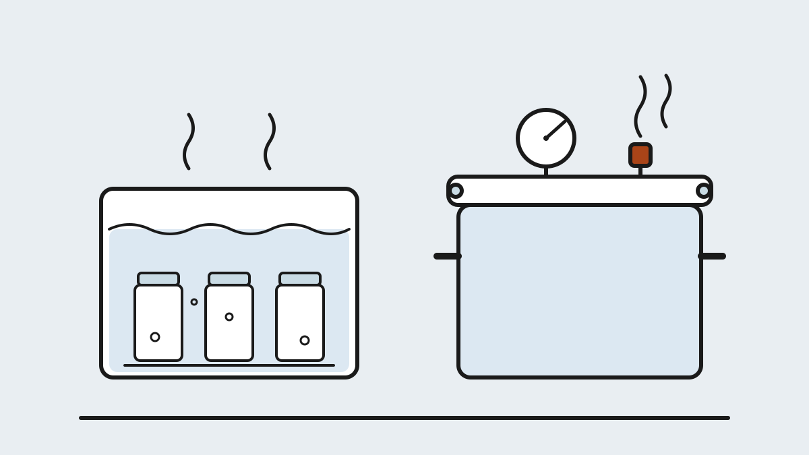

## Why the method is the first decision {#why-method}

Most maker hobbies reward improvisation. Canning is the exception. Before
you buy a single jar, you need to understand the one decision that decides
everything else: **which of the two canning methods your food requires.**
Not prefers — requires. The choice isn't taste or convenience; it's dictated
by the chemistry of the food itself, and getting it wrong isn't a failed
batch, it's an unsafe one.

The good news is that the science is simple, settled, and public. Learn one
number — pH 4.6 — and the entire hobby snaps into focus: why jam needs only
a pot of boiling water while green beans need a pressure vessel, why
tomatoes get a spoonful of lemon juice, and why every trustworthy recipe
reads like a lab procedure. This chapter is that foundation. Every later
chapter — jars, canners, tools — builds on it.

## What a sealed jar actually does {#how-it-works}

Canning does two jobs in one hot operation. First, **heat kills the
microorganisms** already in the food — molds, yeasts and bacteria that
would otherwise spoil it. Second, as the jar cools, the headspace contracts
and pulls the lid down into a **vacuum seal**, so nothing new can get in.
Kill what's inside, lock out what's outside: that's the entire trick, and
it's why home-canned food keeps for a year or more on an ordinary shelf.

The catch is that not all microorganisms die at the same temperature.
Molds, yeasts and most bacteria are gone well below boiling. But some
bacteria form **spores** — dormant, armored versions of themselves — and
the spores of one particular bacterium shrug off hours at 212 °F. Whether
your food can host that bacterium is what splits canning in two.

## The acidity line: pH 4.6 {#acidity}

Every food you might can sits somewhere on the pH scale, and one threshold
matters: **pH 4.6**. Below it (more acidic), the bacterium behind botulism
cannot grow, so boiling-water temperatures are enough to make the jar safe.
Above it (less acidic), its spores can wake up in the sealed jar — and
killing spores takes temperatures that boiling water physically cannot
reach.

  <table class="compare">
    <thead>
      <tr>
        <th>Category</th>
        <th>Foods</th>
        <th>Method required</th>
      </tr>
    </thead>
    <tbody>
      <tr>
        <td><strong>High-acid</strong> (pH below 4.6)</td>
        <td>Most fruits, jams and jellies, fruit butters, pickles and relishes (vinegar-acidified), sauerkraut</td>
        <td>Water bath (or steam)</td>
      </tr>
      <tr>
        <td><strong>Borderline</strong></td>
        <td>Tomatoes, figs — right at the line</td>
        <td>Water bath <em>with added acid</em>, per the recipe</td>
      </tr>
      <tr>
        <td><strong>Low-acid</strong> (pH above 4.6)</td>
        <td>Plain vegetables, beans, corn, potatoes, meats, poultry, seafood, stocks, most soups</td>
        <td>Pressure canning — no exceptions</td>
      </tr>
    </tbody>
  </table>

Two details on this table trip up beginners. **Tomatoes** feel acidic but
modern varieties hover right at 4.6, which is why every tested tomato
recipe adds bottled lemon juice or citric acid — bottled, not fresh,
because bottled juice has a standardized acidity. And **pickled vegetables**
are low-acid foods made high-acid by vinegar; the tested recipe's vinegar
ratio *is* the safety mechanism, which is why you never dilute it to taste.

## Water-bath canning: the gateway {#water-bath}

For high-acid foods, the process is as simple as canning gets: filled,
lidded jars stand on a rack in a deep pot of boiling water, fully
submerged, for the time the recipe states. At 212 °F, everything that could
spoil a high-acid food is dead by the end of the processing time, the jars
come out, and the lids ping down into a seal as they cool.

The equipment barrier is nearly zero — a stockpot deep enough to cover the
jars by an inch, plus a rack to keep them off the bottom, is a legitimate
water-bath canner. An **atmospheric steam canner** is the modern
alternative: it surrounds the jars with pure steam instead of gallons of
water, reaches the same temperature, and heats up in a fraction of the
time. Research-based sources now accept steam canners for high-acid foods
with processing times under 45 minutes; we'll compare them properly in
Chapter 3.

This is where you'll start. Jam, pickles and acidified tomatoes are the
classic first projects for a reason: the method is forgiving, the gear is
cheap, and the failure mode of a mistake is a jar that doesn't seal — which
you notice immediately and just refrigerate.

## Pressure canning: the low-acid tier {#pressure}

<figure>
  
  <figcaption>Same jars, different physics. Boiling water tops out at 212 °F; a sealed canner at 10 PSI pushes the interior to 240 °F — the temperature spores actually die at. Illustration: Makers Manual</figcaption>
</figure>

Low-acid foods need 240 °F to kill botulism spores, and at sea-level
pressure, water simply cannot get that hot — it boils away at 212 °F no
matter how hard the burner works. A **pressure canner** solves this by
sealing the pot: trapped steam raises the internal pressure to 10–15 PSI,
which raises the boiling point to 240–250 °F. Hold that for the recipe's
stated time and the spores are dead too.

The instrument that proves you hit the target is the gauge — either a
**weighted gauge** that rocks or jiggles at its rated pressure, or a
**dial gauge** you read like a speedometer (and have checked for accuracy
yearly). Modern pressure canners are unglamorous, mechanically simple, and
nothing like the exploding pots of family legend — every one sold today
has redundant locks and overpressure vents.

Two distinctions matter before Chapter 3 goes shopping. A pressure
**cooker** — including every Instant-Pot-style multi-cooker with a
"canning" button — is not a pressure **canner**: the small vessel heats
and cools too fast for tested process times to hold, and food-safety
authorities recommend against canning in them. And the two methods are not
interchangeable in either direction — pressure-canning jam doesn't make it
extra safe, it makes it overcooked.

  <table class="compare">
    <thead>
      <tr>
        <th></th>
        <th>Water bath</th>
        <th>Pressure canning</th>
      </tr>
    </thead>
    <tbody>
      <tr>
        <td><strong>Foods</strong></td>
        <td>High-acid only</td>
        <td>Low-acid (and anything, technically)</td>
      </tr>
      <tr>
        <td><strong>Temperature</strong></td>
        <td>212 °F / 100 °C</td>
        <td>240–250 °F / 116–121 °C</td>
      </tr>
      <tr>
        <td><strong>Equipment</strong></td>
        <td>Deep pot + rack; ~$0–40</td>
        <td>Purpose-built canner; ~$90–450</td>
      </tr>
      <tr>
        <td><strong>Typical process time</strong></td>
        <td>5–45 minutes</td>
        <td>20–100 minutes, plus venting and cool-down</td>
      </tr>
      <tr>
        <td><strong>First project</strong></td>
        <td>Jam, pickles, tomatoes</td>
        <td>Green beans, stock, dried beans</td>
      </tr>
    </tbody>
  </table>

## Botulism, plainly {#botulism}

The word hangs over this hobby, so let's put it in plain terms.
*Clostridium botulinum* is a common soil bacterium. On a fresh carrot it's
harmless — it can't do anything in open air. But its spores survive
boiling, and a sealed jar of low-acid food is its perfect habitat: moist,
oxygen-free, not acidic. Given weeks on a shelf, germinated spores produce
botulinum toxin, among the most potent neurotoxins known. The jar won't
necessarily bulge, hiss or smell wrong; contaminated food can look
perfect.

That's the entire logic of everything above. Acid blocks the bacterium
from growing, which is why high-acid foods only need 212 °F. Nothing
blocks it in low-acid foods, so the spores themselves must be killed,
which takes 240 °F, which takes pressure. Home-canning botulism cases are
rare — a handful per year in the US — and essentially all of them trace to
someone water-bathing a low-acid food or improvising a process. Follow the
method the acidity dictates and the tested time, and this risk is
engineered out.

## Tested recipes only {#tested-recipes}

In cooking, a recipe is a suggestion. In canning, a recipe is a
**validated thermal process**: researchers measured how heat penetrates to
the cold center of that food, in that jar size, at that consistency, and
determined the time that makes it safe. Change the variables — thicker
sauce, bigger jar, added flour or extra onions — and the measurement no
longer applies. That's why canners follow tested recipes exactly and save
the creativity for what goes on the plate afterward.

The canonical sources are few and free or cheap:

- **The National Center for Home Food Preservation (NCHFP)** — the
  research hub for US home canning; its website is the reference this
  section will link constantly.
- **The USDA Complete Guide to Home Canning** — the standards document
  behind almost everything else, downloadable free from the NCHFP.
- **The Ball Blue Book** and the Ball/Bernardin websites — tested
  commercial recipe collections, updated regularly.
- **Your state's Cooperative Extension service** — regional recipes and,
  usefully, free dial-gauge testing.

The same authorities maintain a list of methods that persist in family
tradition but were never safe or are now known unsafe: **open-kettle
canning** (pouring hot food into jars with no processing), **oven
canning**, **dishwasher and sun canning**, **paraffin-wax sealing**, and
inversion sealing. If a recipe's provenance is a blog with no tested
source behind it, the polite move is to admire the photography and get the
process times from the NCHFP.

## Altitude changes every number {#altitude}

One last piece of physics before your first batch: published process times
assume sea level. Water boils cooler as you climb — at 5,000 feet it boils
at about 203 °F — so the same minutes deliver less heat. Every tested
recipe includes an altitude table, and the adjustments run in the
direction you'd expect:

  <table class="compare">
    <thead>
      <tr>
        <th>Altitude</th>
        <th>Water bath</th>
        <th>Pressure (weighted gauge)</th>
      </tr>
    </thead>
    <tbody>
      <tr>
        <td>0–1,000 ft</td>
        <td>Time as published</td>
        <td>10 lb</td>
      </tr>
      <tr>
        <td>1,001–3,000 ft</td>
        <td>Add 5 minutes</td>
        <td>15 lb</td>
      </tr>
      <tr>
        <td>3,001–6,000 ft</td>
        <td>Add 10 minutes</td>
        <td>15 lb</td>
      </tr>
      <tr>
        <td>Above 6,000 ft</td>
        <td>Add 15–20 minutes</td>
        <td>15 lb</td>
      </tr>
    </tbody>
  </table>

*Typical adjustments — the recipe card's own table always governs, and
dial-gauge canners adjust in finer 1-pound steps. Look up your elevation
once, write it inside your recipe binder, and the adjustment becomes
automatic.*

## Your first batch {#first-batch}

Here's how the whole system feels in practice, using the classic first
project — a small batch of jam. You simmer fruit, sugar and lemon juice to
the recipe's proportions. You ladle it into clean jars, leaving the
recipe's stated **headspace**, wipe the rims, set on the flat lids, and
screw the bands finger-tight. The jars go into boiling water for the
stated minutes plus your altitude adjustment, then rest on a towel
overnight. Sometime in the first hour, each lid pings down — the sound of
the vacuum forming. In the morning you press each lid center: no flex
means sealed; any that flex go in the fridge and become this week's toast.

Notice what you didn't need: no pressure vessel, no special skill, no
judgment calls. The acidity did the microbiology, the tested time did the
thermodynamics, and you did the ladling. Start here, run a few water-bath
batches until the rhythm is boring, and pressure canning becomes a small
step up rather than a leap.

---

**Next in this section:** the vessels themselves — mason jars, European
glass, and why lids are single-use. Chapter 2 picks the jars worth buying.
*Coming soon.*

## Terms you'll hear {#glossary}

- **Water-bath canning** — processing jars submerged in boiling water; for high-acid foods.
- **Pressure canning** — processing jars in a sealed vessel at 10–15 PSI; required for low-acid foods.
- **pH 4.6** — the acidity threshold that separates the two methods.
- **Headspace** — the deliberate air gap between food and lid; the recipe states it.
- **Two-piece lid** — flat single-use lid plus reusable screw band, the mason-jar standard.
- **Hot pack / raw pack** — filling jars with pre-heated vs. raw food; tested recipes specify which.
- **Processing time** — the validated minutes at temperature for that food, jar size and pack.
- **Weighted gauge / dial gauge** — the two ways a pressure canner shows its pressure.
- **Venting** — letting a pressure canner exhaust air for 10 minutes before pressurizing.
- **Siphoning** — liquid escaping jars during processing; cosmetic, usually from rushed cooling.

## References {#references}

1. [National Center for Home Food Preservation](https://nchfp.uga.edu) — the research-based reference for every process named in this chapter, including [water-bath](https://nchfp.uga.edu/how/can/general-canning-information/), pressure and steam canning.
2. USDA, [Complete Guide to Home Canning](https://nchfp.uga.edu/publications/publications_usda.html) — the standards document; free PDF via the NCHFP.
3. CDC, [Botulism and home-canned foods](https://www.cdc.gov/botulism/) — what the risk actually is and the case data behind it.
4. [Ball / Bernardin](https://www.ballmasonjars.com) — tested recipes and the current *Ball Blue Book Guide to Preserving*.
5. Cooperative Extension: [Penn State Extension home food preservation](https://extension.psu.edu/food-safety-and-quality/home-food-safety/food-preservation) and [Utah State University Extension](https://extension.usu.edu/preserve-the-harvest/) publish regional guidance and altitude tables; most state offices also test dial gauges for free.
6. Wikipedia, [Home canning](https://en.wikipedia.org/wiki/Home_canning) and [Clostridium botulinum](https://en.wikipedia.org/wiki/Clostridium_botulinum) — background and history.
{: .references}

*Links accessed August 2026. Process times and altitude adjustments in
this chapter are illustrative — always take the exact numbers from the
tested recipe you're following.*
