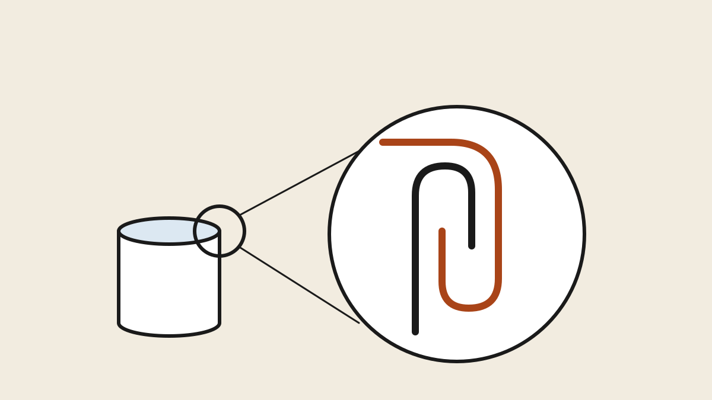

## Why can in metal at all {#why-metal}

Everything else in this section assumes a mason jar, so start with why
anyone reaches for tin. The answer is mostly geography and volume. In the
salmon regions of Alaska and the Pacific Northwest, home canning in metal
cans never stopped being normal: a fish camp putting up two hundred cans
of sockeye can't baby glass across a skiff, and a hunter with a moose
doesn't want a pantry wall of jars that must be kept dark and handled
gently. Metal is unbreakable, light-proof, lighter than glass, stacks like
ammunition and ships like cargo.

The trade is convenience for commitment:

  <table class="compare">
    <thead>
      <tr>
        <th></th>
        <th>Glass jars</th>
        <th>Tin cans</th>
      </tr>
    </thead>
    <tbody>
      <tr>
        <td><strong>Reuse</strong></td>
        <td>Jars and bands reused for decades; flat lids single-use</td>
        <td>Entire can and lid single-use</td>
      </tr>
      <tr>
        <td><strong>Breakage / light</strong></td>
        <td>Breaks; contents fade in light</td>
        <td>Unbreakable, light-proof</td>
      </tr>
      <tr>
        <td><strong>Sealing gear</strong></td>
        <td>None — lids seal themselves in processing</td>
        <td>A can sealer (seamer), bought once</td>
      </tr>
      <tr>
        <td><strong>Seal check</strong></td>
        <td>Press the lid, look through the glass</td>
        <td>Inspect the seam; you can't see the food again</td>
      </tr>
      <tr>
        <td><strong>Best fit</strong></td>
        <td>Small batches, variety, gifts</td>
        <td>Big single-food runs: a fish season, a deer, a steer share</td>
      </tr>
    </tbody>
  </table>

If your canning is a dozen jars of jam a summer, stay with glass. This
chapter is for the batch canner: the season's fish, the year's meat.

## The Chapter 1 rules still govern {#same-rules}

Nothing about metal suspends the science in
[the first chapter](canning-explained.html). Fish, shellfish, poultry and
red meat are all **low-acid foods**, which means every can in this chapter
goes through a **pressure canner at 240 °F** — there is no water-bath
version of canned salmon, and a sealed can that skipped the pressure step
is a botulism incubator with better packaging. Process times still come
only from **tested sources**, and for tin cans specifically the living
authorities are the Cooperative Extension services of the fish states —
University of Alaska Fairbanks above all — plus the Pacific Northwest
extension publications on canning seafood. Cans often carry *different*
tested times than jars of the same food, because metal transfers heat
differently than glass; you cannot borrow a jar time for a can.

What metal adds is two steps glass never asked of you. Jars vent steam
through their lids during processing and seal themselves afterward; a
seamed can is sealed *before* it ever enters the canner. So you must first
drive the air out yourself — **exhausting** — and then make the seal
yourself, mechanically — the **double seam**. Those two skills are the
whole chapter.

## The sealer, the cans and the linings {#gear}

The gating purchase is the **can sealer** — a hand-cranked bench machine
that rolls a lid onto a can body. The classic home units are cast-iron
flywheel machines sold by the same houses that supply Alaska fish camps;
they're simple, adjustable to a couple of can sizes, and effectively
buy-once tools. Expect a few hundred dollars, which is why this chapter
sits at the advanced end of the section: the sealer only pays for itself
in volume.

Cans and their lids come together, sized in the old packer designations.
For home fish canning the traditional sizes are the **half-pound flat**
and the **one-pound tall** — short cylinders sized so a salmon steak packs
in one layer. Meats commonly go in the taller No. 2 and No. 2½ sizes. And
cans, unlike jars, have opinions about their contents — the lining matters:

  <table class="compare">
    <thead>
      <tr>
        <th>Can type</th>
        <th>Interior</th>
        <th>Use for</th>
      </tr>
    </thead>
    <tbody>
      <tr>
        <td><strong>Plain tin</strong></td>
        <td>Bare tinplate</td>
        <td>Most meats and light-colored foods</td>
      </tr>
      <tr>
        <td><strong>C-enamel</strong></td>
        <td>Sulfur-resistant coating</td>
        <td>Seafood and corn — stops the harmless but ugly dark sulfide staining</td>
      </tr>
      <tr>
        <td><strong>R-enamel</strong></td>
        <td>Acid-resistant coating</td>
        <td>Red and strongly colored foods (beets, berries) — less relevant here</td>
      </tr>
    </tbody>
  </table>

Buy fish cans as C-enamel and you'll never open a can of gray-ringed
salmon that was perfectly safe but looks like a mistake.

## Exhausting: the step glass never taught you {#exhausting}

A jar pushes its own air out as it processes. A can must be emptied of air
*before* the lid goes on, or there's no vacuum on the shelf and the ends
bulge with every warm day. The fix is **exhausting**: the filled, open
cans are heated — standing in a shallow bath of simmering water, or run
under steam — until a thermometer in the **center of the can** reads about
**170 °F (77 °C)**. Then, still hot, each can gets its lid and goes
straight to the seamer. Seal hot air in, and as the can cools after
processing that air contracts into the vacuum that keeps the ends drawn
in tight.

The habit to build: exhaust, seam, process as one continuous motion. A
filled can waiting around at room temperature is losing the temperature
that makes its vacuum — and warm fish or meat sitting in the danger zone
is its own problem. Work in seamer-sized batches.

## The double seam — and how to prove yours works {#seam}

<figure>
  
  <figcaption>The double seam, loosened for clarity: the lid's curl (orange) and the can body's flange hook into each other and are rolled flat — five thicknesses of interlocked metal. Illustration: Makers Manual</figcaption>
</figure>

A can has no gasket and no threads. Its entire seal is the **double seam**:
the seamer's first roller curls the lid's edge under the can body's
flange, hooking them together; the second roller irons that hook flat into
five interlocked thicknesses of metal, with a bead of sealing compound —
already applied inside every new lid's curl — squeezed through the joint.
Done right, it's the same seam on every supermarket can, and it's why this
method needs no luck: the seam either measures right or it doesn't.

Because the seam *is* the safety, you test it before you trust it:

- **Practice first.** Seam a few empty cans, or cans of plain water, before
  any food is involved — every new sealer, every season, and after any
  adjustment.
- **The water test.** Seam a can of water, submerge it in near-boiling
  water for a few seconds, and watch. A stream of bubbles from the seam is
  a failed seal and a sealer that needs adjusting.
- **Look at every can.** A good seam is smooth, even and tight to the body
  all the way around. Sharp edges, wrinkles ("droops"), or a seam you can
  catch a thumbnail under mean re-adjustment — and that can's contents go
  in the fridge, not the pantry.

## Processing, then the cold-water cool-down {#processing}

The sealed cans process in the same pressure canner as your jars, on the
same rack, at the same 10–15 PSI — but on **can-specific tested times**,
which for fish run long: on the order of an hour and a half or more for
salmon in half-pound flats. Take the exact figure from the extension
publication for your food, can size and altitude, exactly as Chapter 1
preached.

The end of the run is where can habits invert jar habits. Jars come out of
the canner and sit undisturbed while their lids ping. Cans, already
sealed, should be **cooled fast in clean cold water** the moment pressure
is down — it stops the cooking, keeps the sealing compound seated, and
pulls the vacuum quickly. Change or run the water until the cans are cool
to the touch, then dry them so they don't rust, label them (a paint marker
on the end beats a label that falls off), and shelve.

## Fish: the salmon workflow {#fish}

Fish is the food this tradition was built around, and the workflow shows
how neatly the pieces fit. The fish is cleaned, skin left on, and cut
crosswise into can-height pieces. Pieces pack vertically into half-pound
flats, skin out, filled snug to the recipe's headspace — and that's the
whole recipe: **no added liquid**, because fish makes its own during
processing, and salt only if you want it, for flavor alone. Exhaust to
temperature, seam, process, cool. Bones and skin go in; the pressure
process softens the bones to the same soft crumble you know from
store-bought salmon, and they're most of the calcium.

Tuna is the one common exception to raw packing — it's typically precooked,
cooled and trimmed before it goes in the can, which is why tuna recipes
read longer. Smoked fish is its own tested category with its own times.
Either way the source is the same shelf: the Alaska and Pacific Northwest
extension publications written for exactly this.

## Meat: packs, fat and broth {#meat}

Red meat, game and poultry can in metal on the same skeleton: pack, exhaust,
seam, process on the tested time for that meat and can size. The
meat-specific rules are few and firm. **Trim fat aggressively** — fat
shortens shelf life, and fat riding up over the flange is the classic
cause of a seam that looks perfect and fails anyway. **No flour, no
thickeners, no packed-solid grinds** — anything that slows heat reaching
the center invalidates the tested time; gravy happens when you open the
can, not before. Raw packs go in cold with no liquid; hot packs are
browned and covered with boiling broth to headspace. And exhausting is
non-negotiable for meat's dense packs — the center of the can, not the
edge, has to hit temperature.

## Storage, inspection and the boil rule {#storage}

A tin pantry needs slightly different eyes than a glass one, because you
can't see the food. Store cool, dry and dark — dry matters more than with
jars, since a rusted seam is a compromised seam. Date every can, eat
oldest first, and inspect on the way in *and* out: ends should be flat or
slightly concave and stay put when pressed. A **swollen end, a leak, rust
along the seam, or spurting liquid when opened** means the can and its
contents go in the trash, unopened or untasted — with low-acid canned
food, "when in doubt, throw it out" is the entire debate.

One belt-and-suspenders habit worth keeping from the older manuals: boil
home-canned low-acid food ten minutes before tasting it. Modern tested
processes make this optional, and plenty of experienced canners skip it —
but botulinum toxin is destroyed by boiling, so the habit converts any
process mistake you didn't catch into a smell in the kitchen instead of a
hospital visit. It costs ten minutes; your call.

---

**Elsewhere in this section:** the glass fundamentals continue — Chapter 2
picks the jars, lids and seals worth buying. *Coming soon.*

## Terms you'll hear {#glossary}

- **Can sealer / seamer** — the hand-cranked machine that rolls lids onto can bodies.
- **Double seam** — the five-thickness rolled joint that seals a can; formed in two roller operations.
- **First / second operation** — the seamer's two passes: curl the hook, then flatten it tight.
- **Exhausting** — heating open, filled cans to ~170 °F at center before seaming, so cooling creates a vacuum.
- **Flange** — the can body's out-turned top edge that the lid hooks onto.
- **Sealing compound** — the gasket material pre-applied inside the curl of every new can lid.
- **Half-pound flat / one-pound tall** — the traditional fish-can sizes.
- **C-enamel** — sulfur-resistant can lining used for seafood and corn.
- **Droop / wrinkle** — visible seam defects that mean the sealer needs adjustment.
- **Swell** — a bulged can end from gas inside; the unambiguous discard sign.

## References {#references}

1. University of Alaska Fairbanks Cooperative Extension, [home food preservation publications](https://www.uaf.edu/ces/publications/) — the standing authority on home-canning fish in cans, including sealer operation and tested times.
2. Oregon State University Extension, [*Canning Seafood* (PNW 194)](https://catalog.extension.oregonstate.edu/pnw194) — the Pacific Northwest tested reference for fish and shellfish.
3. [National Center for Home Food Preservation](https://nchfp.uga.edu) — tested processes for [meats, poultry and seafood](https://nchfp.uga.edu/how/can/canning-poultry-red-meats-and-seafood/), and the general canning standards this chapter leans on.
4. USDA, [Complete Guide to Home Canning](https://nchfp.uga.edu/publications/publications_usda.html) — the standards document; earlier USDA bulletins documented tin-can processes and remain the basis for extension guidance.
5. [Wells Can Company](https://wellscan.ca) — long-running supplier of home canning cans, lids and sealers in the traditional sizes.
6. CDC, [Botulism and home-canned foods](https://www.cdc.gov/botulism/) — the risk picture behind every rule above.
{: .references}

*Links accessed August 2026. All process times in this chapter are
illustrative — take the exact time for your food, can size, pack and
altitude from the tested publication you're following.*
