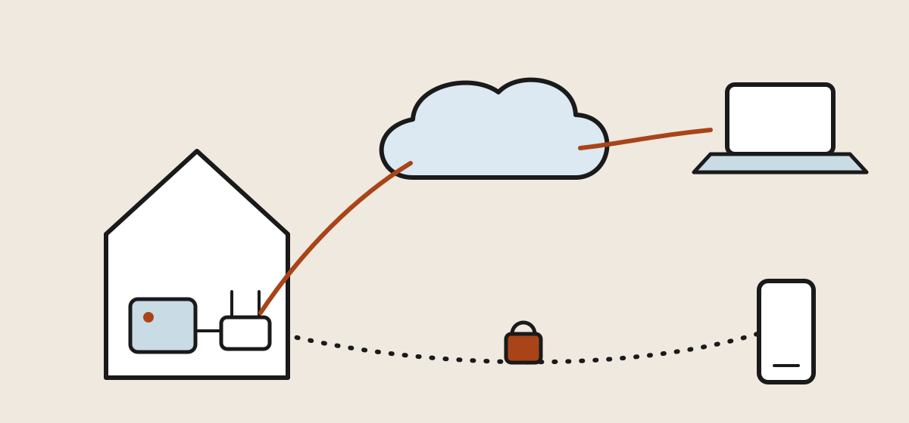

## Why the server is a mini PC now {#why-mini-pc}

The home server used to be a retired tower in a closet: loud, hungry and
big. The machine that replaced it fits under one hand. Our worked example
for this chapter is the **GMKtec G11** — an AMD Ryzen Embedded R2514 with
16 GB of RAM, a 512 GB NVMe drive and *two* 2.5-gigabit Ethernet ports,
street price around $340 — but any recent mini PC from the same shelf
(Beelink, Minisforum, a used Lenovo Tiny) builds the same server. What
matters is the shape of the spec sheet, not the badge:

<div class="table-scroll">
  <table class="compare">
    <thead>
      <tr>
        <th>Spec</th>
        <th>What it buys you</th>
        <th>The G11</th>
      </tr>
    </thead>
    <tbody>
      <tr>
        <td><strong>CPU</strong></td>
        <td>Any modern quad-core is overkill for a website and a VPN</td>
        <td>4-core Ryzen Embedded R2514</td>
      </tr>
      <tr>
        <td><strong>RAM</strong></td>
        <td>16 GB runs a dozen services in containers without thinking</td>
        <td>16 GB DDR4</td>
      </tr>
      <tr>
        <td><strong>Storage</strong></td>
        <td>NVMe keeps everything instant; 512 GB is years of headroom</td>
        <td>512 GB PCIe M.2</td>
      </tr>
      <tr>
        <td><strong>Network</strong></td>
        <td>One port is enough; a second opens future router projects</td>
        <td>Dual 2.5 GbE</td>
      </tr>
      <tr>
        <td><strong>Idle draw</strong></td>
        <td>The always-on economics — roughly a dollar a month</td>
        <td>~10 W at idle</td>
      </tr>
    </tbody>
  </table>
</div>

That last row is the quiet revolution. An old tower idling at 100 W costs
more per year in electricity than the mini PC costs to run for a decade of
always-on duty. The box ships with Windows 11 Pro; we're about to wipe it,
because a headless server wants an operating system built for the job.

## The shape of the build {#the-plan}

<figure>
  
  <figcaption>Two ways in, neither through an open port: site visitors (solid) reach the server through a tunnel it opened outward to a relay; you (dashed) come straight home over the VPN. <span class="credit">Illustration: Makers Manual</span></figcaption>
</figure>

Before any commands, hold the architecture in your head, because one
principle decides everything downstream: **the router forwards zero
inbound ports.** Nothing on the internet can knock on your house directly.

- **Ubuntu Server** is the base — the long-term-support release, run
  headless and managed over SSH.
- **Docker** runs each service in its own container, so the website, the
  tunnel and everything you add later stay untangled.
- **Caddy** serves the website itself on the home LAN.
- A **Cloudflare Tunnel** carries public visitors in: the server opens an
  *outbound* connection to Cloudflare, and Cloudflare routes your domain —
  ours goes by **example.family** in these pages — down that tunnel. Your home IP address
  never appears in public DNS.
- **Tailscale** (WireGuard underneath) is the private door: your phone and
  laptop join an encrypted mesh with the server, and through it, the whole
  home network.

The website path and the VPN path never touch. If one is misconfigured,
the other still works — which matters most on the day you're debugging the
web server from another continent, over the VPN.

## What did your ISP actually give you? {#public-ip}

One fact about your internet service shapes the whole project: whether
your house has a **real public IP address** or sits behind **CGNAT** —
carrier-grade NAT, where the ISP parks whole neighborhoods behind one
shared address. Check it in two minutes: open your router's status page
and note its WAN address, then visit a what's-my-IP site from the same
network. If the two match, the internet can (in principle) reach your
router, and every technique in this chapter plus classic port forwarding
is available. If they differ — or the router's WAN address starts with
**100.64** through **100.127**, the range reserved for CGNAT — inbound
connections can never find you, and the tunnel-and-mesh design isn't just
elegant, it's mandatory.

Our example line (fiber, with a real public address) passes the check.
The build below doesn't care either way — that's the point of choosing
outbound-only plumbing — but knowing your answer tells you which doors
are open later, and it's the first question in any home-hosting forum
thread you'll ever post.

## Ubuntu Server: the install hour {#ubuntu}

On another computer, download the **Ubuntu Server LTS** ISO and flash it
to a USB stick with Etcher or Rufus. Plug the mini PC into a monitor,
keyboard and — this matters — **wired Ethernet**, then tap Delete or F7 at
power-on for the boot menu and boot the stick. The installer wants four
decisions:

1. **Use the entire disk.** Windows and its recovery partitions go;
   the box has one job now.
2. **Create your user.** This account will hold the keys to everything.
3. **Check "Install OpenSSH server."** The one checkbox you must not miss —
   it's how you'll ever talk to the machine again.
4. Skip the featured snaps; we'll install what we need deliberately.

While you're near the firmware, make one BIOS change: set **Restore on AC
Power Loss** to *Power On*. A headless server that sulks in the dark after
a power blink, while you're a fourteen-hour flight away, is the classic
home-hosting failure. This one setting is the fix.

Last, give the box a permanent address the easy way: in your router's DHCP
settings, add a **reservation** so the server always receives the same LAN
address (say, `192.168.1.10`). Then unplug the monitor and keyboard —
you're done with them for the life of the machine:

```
ssh you@192.168.1.10
```

## The first-hour hardening {#hardening}

Ten minutes of setup keeps the box boring for years. Run the updates,
then let the machine take over its own security patching:

```
sudo apt update && sudo apt upgrade -y
sudo apt install -y unattended-upgrades
sudo dpkg-reconfigure -plow unattended-upgrades
```

Next, retire passwords. From your laptop, copy your SSH key over, then
turn password logins off on the server:

```
ssh-copy-id you@192.168.1.10        # run on your laptop
```

In `/etc/ssh/sshd_config` set `PasswordAuthentication no`, then
`sudo systemctl restart ssh`. From here, only a machine holding your key
can log in — a stolen password is worthless.

Finally the firewall. Allow SSH from the home network only, and nothing
else inbound:

```
sudo ufw allow from 192.168.1.0/24 to any port 22 proto tcp
sudo ufw enable
```

Notice what we did *not* do: no port forwards on the router, no SSH
exposed to the internet, no fail2ban babysitting a public login page —
because there is no public login page. The attack surface stays at zero
and everything that follows keeps it there.

## The VPN: WireGuard, worn two ways {#vpn}

The modern home VPN is **WireGuard** — a lean, fast, audited protocol
that has largely retired OpenVPN. You can run it two ways, and the right
first choice is the one that removes the failure modes: **Tailscale**,
which is WireGuard underneath with the key exchange, the NAT traversal
and the CGNAT problem all handled for you, free for personal use. On the
server:

```
curl -fsSL https://tailscale.com/install.sh | sh
sudo tailscale up --advertise-routes=192.168.1.0/24 --advertise-exit-node
```

Enable packet forwarding so the server can route for the rest of the
house:

```
echo 'net.ipv4.ip_forward=1' | sudo tee /etc/sysctl.d/99-tailscale.conf
sudo sysctl -p /etc/sysctl.d/99-tailscale.conf
```

And open the firewall for the tailnet interface — without this, the
LAN-only SSH rule from [§ 5](#hardening) will lock the VPN itself out
(*added Aug 28, after the first real build caught it — see the
[field notes](home-server-field-notes.html)*):

```
sudo ufw allow in on tailscale0
sudo ufw route allow in on tailscale0
```

Then three clicks in Tailscale's admin console: approve the **subnet
route**, approve the **exit node**, and disable key expiry for this
machine. Install the app on your phone and laptop, sign in, done.

What you've built is better than the corporate VPNs you've suffered
through. From anywhere on earth, your devices reach the server *and every
address in the house* — the printer, the NAS, the router's own admin page
— exactly as if you were on the couch. Flip on the **exit node** from
hotel Wi-Fi and all your traffic rides home encrypted first, which is the
classic privacy-VPN trick without the subscription.

The self-hosted alternative — plain WireGuard via the `wg-easy` container
— trades that convenience for total independence: no third-party
coordination service, but you must have a real public IP
([§ 3](#public-ip)), forward UDP port 51820, and keep a dynamic-DNS name
pointed at the house. It's a fine second project. Start with the version
that works from behind any network you'll ever sit in.

## The domain: pointing example.family at the project {#domain}

A home server without a name is a hobby; with one, it's infrastructure.
Our domain for this build is **example.family** — and wherever it was
registered, the first move is to put its DNS on **Cloudflare's free
plan**: add the site in the Cloudflare dashboard, then change the
nameservers at your registrar to the pair Cloudflare assigns. Propagation
takes minutes to hours.

Why Cloudflare specifically? Because for a home server it collapses three
jobs into one dashboard: DNS hosting, automatic HTTPS certificates, and —
the piece the next section builds on — the tunnel that carries visitors
to your living room without publishing your home address. Plan the
namespace while you're there: the bare domain and `www` for the site, and
a subdomain per future service (`photos.example.family`,
`recipes.example.family`) — each one later becomes a single extra line
on the same tunnel.

## Serving the site: Docker, Caddy and the tunnel {#web}

Install Docker the boring, official way:

```
curl -fsSL https://get.docker.com | sh
sudo usermod -aG docker $USER      # then log out and back in
```

The whole web stack is one `compose.yaml` in a project folder — Caddy to
serve the site, `cloudflared` to carry the tunnel:

```
services:
  web:
    image: caddy:latest
    restart: unless-stopped
    volumes:
      - ./site:/usr/share/caddy
  tunnel:
    image: cloudflare/cloudflared:latest
    restart: unless-stopped
    command: tunnel run
    environment:
      - TUNNEL_TOKEN=${TUNNEL_TOKEN}
```

Drop an `index.html` in `./site`, then create the tunnel in Cloudflare's
dashboard under **Zero Trust → Networks → Tunnels**: it hands you a token
(put it in a `.env` file next to the compose file), and a **Public
Hostname** tab where you map `example.family` — and `www` — to
`http://web:80`. Compose puts both containers on one network, so the
tunnel finds Caddy by its service name. Then:

```
docker compose up -d
```

That's the launch. **https://example.family** is live worldwide, with a
certificate Cloudflare manages, from a box whose router still forwards
nothing. Every future service is the same recipe: another container,
another hostname line on the same tunnel. And anything you *don't* want
public — dashboards, admin panels — simply never gets a hostname; you
reach it over Tailscale instead.

## Tunnel or port forward? {#exposure}

The traditional way to host from home — forward ports 80 and 443 to the
server, run a dynamic-DNS updater, let Caddy fetch its own certificates —
still works, and purists prefer it. The honest comparison:

<div class="table-scroll">
  <table class="compare">
    <thead>
      <tr>
        <th></th>
        <th>Cloudflare Tunnel</th>
        <th>Port forwarding + DDNS</th>
      </tr>
    </thead>
    <tbody>
      <tr>
        <td><strong>Open inbound ports</strong></td>
        <td>None</td>
        <td>80 and 443, to your LAN</td>
      </tr>
      <tr>
        <td><strong>Home IP in public DNS</strong></td>
        <td>Hidden — visitors see Cloudflare</td>
        <td>Published to the world</td>
      </tr>
      <tr>
        <td><strong>Works behind CGNAT</strong></td>
        <td>Yes</td>
        <td>No</td>
      </tr>
      <tr>
        <td><strong>ISP blocks port 80/443</strong></td>
        <td>Irrelevant</td>
        <td>Fatal — some residential plans do</td>
      </tr>
      <tr>
        <td><strong>IP address changes</strong></td>
        <td>Invisible</td>
        <td>DDNS updater must win the race</td>
      </tr>
      <tr>
        <td><strong>Third-party dependency</strong></td>
        <td>Cloudflare sits in the path</td>
        <td>None — fully yours</td>
      </tr>
    </tbody>
  </table>
</div>

For a family site, the tunnel wins on every row that involves risk, and
loses only on independence. Our verdict: launch on the tunnel; graduate
to self-terminated hosting later if the dependency starts to chafe —
Caddy is already in place and won't need to change.

## Care, backups and the travel test {#care}

An appliance-grade server needs three habits, not a maintenance schedule.

**Updates** are already handled: unattended-upgrades patches the OS
nightly, and a monthly `docker compose pull && docker compose up -d`
refreshes the containers. **Backups** follow one rule — anything you'd
mourn leaves the box. The site folder and any container volumes go
off-site nightly with `restic` to a cheap object store like Backblaze B2;
a server you can rebuild from a backup in an hour is a server you never
fear. A small UPS is optional but turns brownouts from reboots into
non-events.

Then, before any trip, the **travel test** — from your phone with Wi-Fi
*off*, so you're truly outside the house: the website loads, an SSH
session over Tailscale opens, and the router's admin page answers through
the subnet route. Five minutes, and the difference between confidence and
a vacation spent wondering.

---

**Elsewhere in this section:** the server is one box on a network that
deserves the same thought — Chapter 2 takes on the router, the switch and
the access points. *Coming soon.*

## Terms you'll hear {#glossary}

- **Headless** — a server run with no monitor or keyboard, managed entirely over the network.
- **CGNAT** — carrier-grade NAT; your ISP shares one public address across many homes, making inbound connections impossible.
- **DHCP reservation** — a router rule pinning a device to one LAN address forever; the sane alternative to static-IP fiddling.
- **Container** — one service packaged with its dependencies, isolated from the rest of the box; Docker is the runtime.
- **Reverse proxy** — the front-door web server (Caddy here) that receives every request and routes it to the right service.
- **Tunnel** — an outbound connection a server holds open to a relay, so inbound traffic can ride it backward without any open ports.
- **WireGuard** — the modern VPN protocol: small, fast, in the Linux kernel.
- **Tailnet** — your private Tailscale mesh; every signed-in device can reach every other, wherever both are.
- **Subnet router** — the tailnet node that forwards traffic to an entire home LAN, so devices without the app are reachable too.
- **Exit node** — a tailnet machine that routes *all* your traffic, making distant Wi-Fi behave like your home connection.
- **DDNS** — dynamic DNS; a daemon that re-points your domain whenever the ISP changes your home address.

## References {#references}

1. Canonical, [Ubuntu Server documentation](https://documentation.ubuntu.com/server/) — installation and administration for the LTS release.
2. Mozilla, [OpenSSH configuration guidelines](https://infosec.mozilla.org/guidelines/openssh) — the key-only, hardened SSH posture in § 5.
3. Tailscale, [documentation](https://tailscale.com/kb/) — notably [subnet routers](https://tailscale.com/kb/1019/subnets) and [exit nodes](https://tailscale.com/kb/1103/exit-nodes).
4. [WireGuard](https://www.wireguard.com) and the [wg-easy project](https://github.com/wg-easy/wg-easy) — the self-hosted alternative in § 6.
5. Cloudflare, [Cloudflare Tunnel documentation](https://developers.cloudflare.com/cloudflare-one/connections/connect-networks/) — creating tunnels and public hostnames.
6. Docker, [Install Docker Engine on Ubuntu](https://docs.docker.com/engine/install/ubuntu/) and [Caddy documentation](https://caddyserver.com/docs/) — the serving stack.
7. [restic](https://restic.net) with [Backblaze B2](https://www.backblaze.com/cloud-storage) — the off-site backup pairing in § 10.
8. IETF, [RFC 6598](https://www.rfc-editor.org/rfc/rfc6598) — the document that reserves 100.64.0.0/10, the address range that tells you you're behind CGNAT.
{: .references}

*Links accessed August 2026. Example addresses in this chapter
(192.168.1.x) are placeholders — substitute your own network's, and treat
your public IP as private information even though machines can discover it.*
