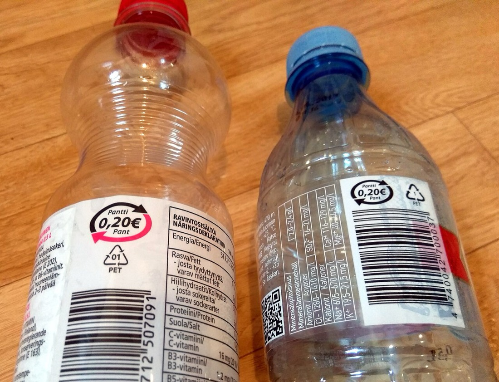
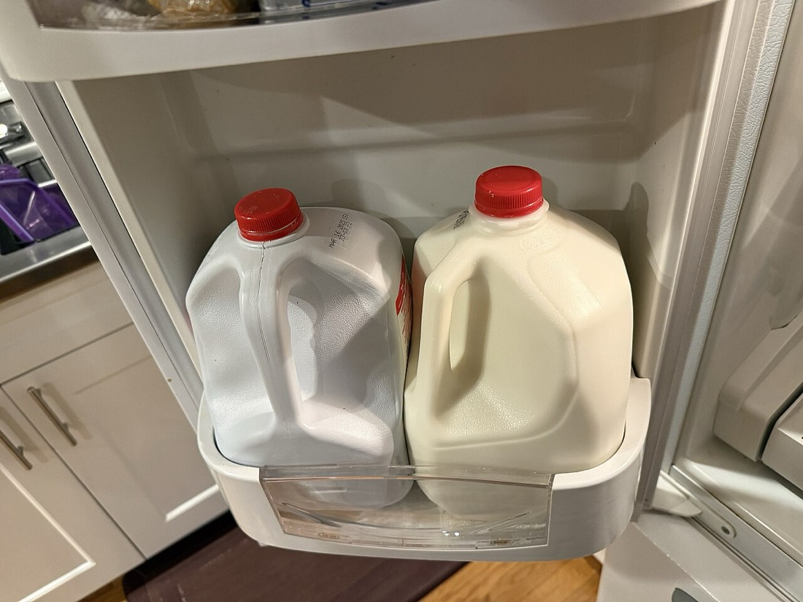
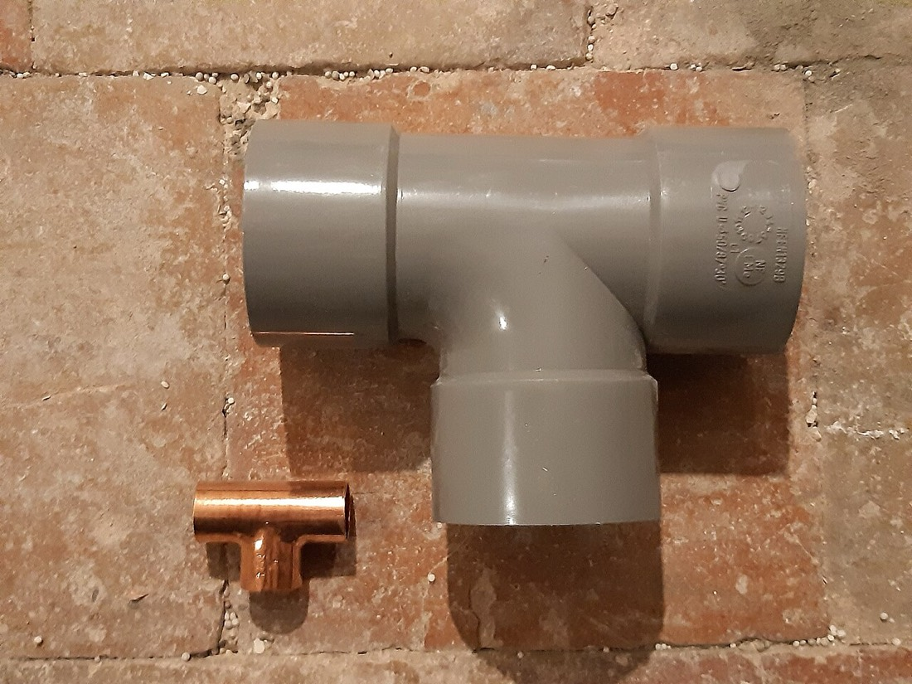
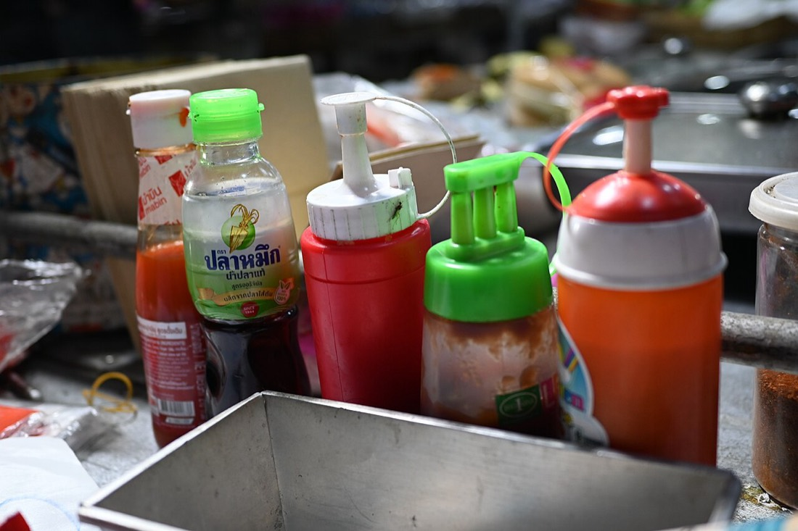
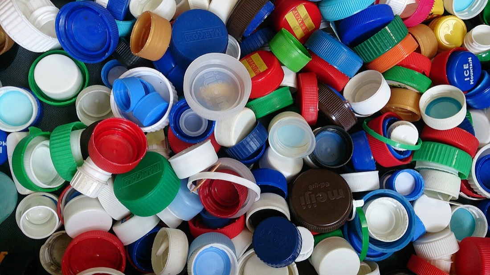
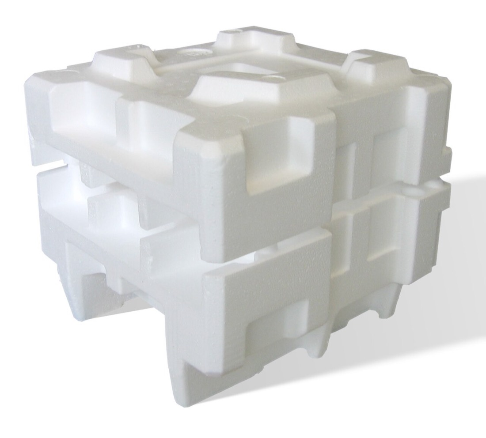

## Why learning plastics pays {#why-plastics}

Wood workers know oak from pine. Cooks know butter from shortening. But
plastic, the material we handle more than any other, mostly gets treated
as one anonymous substance — and it isn't. The milk jug, the soda
bottle, the yogurt cup and the produce bag are four different polymers
with different melting points, different chemical tolerances and
different afterlives, and they are *not* interchangeable.

Learning to tell them apart pays off three ways, and each gets its own
chapter in this section. It tells you **how the object was made** and
therefore what quality looks like (Chapter 2). It tells you **which
products to buy and how to use them safely** — what can take a
microwave, a dishwasher, a freezer (Chapter 3). And it tells you **what
actually happens when you throw it away** — the gap between the
recycling triangle and reality is the subject of Chapter 4. This chapter
is the foundation: the vocabulary, the six polymers, and how to identify
them with nothing but your hands.

## What a plastic actually is {#what-plastic-is}

Every plastic is a **polymer**: a molecule built by chaining thousands
of copies of one small unit — a **monomer** — into a strand, the way a
paper chain is built from identical loops. Polyethylene is chained
ethylene. Polypropylene is chained propylene. Polystyrene is chained
styrene. The name usually confesses the recipe.

The single most useful distinction in the whole subject is what happens
when you heat the result. A **thermoplastic** softens and melts —
its chains are separate strands, tangled like cooked spaghetti but not
bonded to each other, so heat lets them slide and the material can be
melted, formed and *re-melted*. A **thermoset** is different: during
manufacture its chains cross-link into one connected network, a
permanent set that heat cannot undo. Push a thermoset past its limit
and it doesn't melt — it chars.

That's why a yogurt cup slumps in a hot oven while a pan handle
survives the stovetop, and it has two consequences this section returns
to constantly: thermoplastics can be remolded, which is what makes both
mass manufacturing (Chapter 2) and mechanical recycling (Chapter 4)
possible — and thermosets, whatever their virtues, can be neither.
Nearly everything in your house is thermoplastic; the notable household
thermoset is the melamine dinner plate, which we'll meet below.

One more word you'll see on packaging and in every later chapter:
**resin** is simply the industry's term for the raw plastic itself,
sold as rice-sized pellets before it becomes anything.

## The seven codes: identification, not a promise {#codes}

Flip over almost any plastic container and you'll find a number in a
triangle of chasing arrows. That mark is the **resin identification
code**, introduced by the plastics industry in 1988, and here is the
most important sentence in this chapter: **it identifies what the item
is made of — it does not promise that anyone will recycle it.** The
arrows are the most successful piece of ambiguous graphic design of the
twentieth century, and Chapter 4 takes the myth apart properly. For
now, use the code for what it's genuinely good at: naming the polymer.

  <table class="compare">
    <thead>
      <tr>
        <th>Code</th>
        <th>Polymer</th>
        <th>You know it as</th>
      </tr>
    </thead>
    <tbody>
      <tr>
        <td><strong>1</strong></td>
        <td>PET — polyethylene terephthalate</td>
        <td>Soda and water bottles, clamshells</td>
      </tr>
      <tr>
        <td><strong>2</strong></td>
        <td>HDPE — high-density polyethylene</td>
        <td>Milk jugs, detergent bottles, buckets</td>
      </tr>
      <tr>
        <td><strong>3</strong></td>
        <td>PVC — polyvinyl chloride</td>
        <td>Pipe, cable insulation, shower curtains</td>
      </tr>
      <tr>
        <td><strong>4</strong></td>
        <td>LDPE — low-density polyethylene</td>
        <td>Produce bags, squeeze bottles, flexible lids</td>
      </tr>
      <tr>
        <td><strong>5</strong></td>
        <td>PP — polypropylene</td>
        <td>Yogurt tubs, bottle caps, food containers</td>
      </tr>
      <tr>
        <td><strong>6</strong></td>
        <td>PS — polystyrene</td>
        <td>Foam cups, disposable cutlery, CD cases</td>
      </tr>
      <tr>
        <td><strong>7</strong></td>
        <td>Other — everything else</td>
        <td>Polycarbonate, ABS, nylon, PLA and more</td>
      </tr>
    </tbody>
  </table>

Codes 1 through 6 are specific materials; 7 is a catch-all drawer.
The six named ones — plus a short list of notable 7s — cover
essentially every plastic object in an ordinary house, so let's meet
them one at a time.

## PET (#1): the clear athlete {#pet}

<figure>
  
  <figcaption>The uniform of the bottle aisle — and, on the left label, the resin code doing its actual job: <em>01 PET</em>, identification in print. Photo: <a href="https://commons.wikimedia.org/wiki/File:Recyclable_finnish_plastic_bottles_with_deposit.jpg">Fourteenzerozero</a> / Wikimedia Commons (CC0)</figcaption>
</figure>

**Where you meet it:** every carbonated-drink and water bottle, salad
clamshells, peanut-butter jars, the fuzzy side of fleece (yes — PET
spun into fiber is polyester).

PET's job is being **transparent, strong and gas-tight** at absurdly
low weight. A 2-liter bottle weighs about 50 grams and holds carbonation
at several times atmospheric pressure for months — that's a genuinely
elite pressure vessel, and it's why PET owns the bottle aisle. In hand
it's glossy and stiff, and a thin PET clamshell makes that distinctive
brittle *crinkle*.

Its weakness is heat: PET starts softening and warping around
**60 °C / 140 °F** — a parked car in summer is enough to distort a
bottle. Never microwave it, don't refill single-use bottles with hot
liquid, and don't run them through a dishwasher expecting them to keep
their shape. None of that is a defect; PET was hired for cold drinks,
and at that job it's unbeatable. It is also, alongside HDPE, one of the
two plastics that genuinely get recycled at scale — Chapter 4 explains
why those two and barely anything else.

## HDPE (#2): the workhorse {#hdpe}

<figure>
  
  <figcaption>The gallon jug, HDPE's signature role — blow-molded by the billion, waxy to the thumbnail, with Chapter 2's pinch-off seam hiding on the base. Photo: <a href="https://commons.wikimedia.org/wiki/File:Two_milk_gallons_in_refrigerator_door.agr.jpg">ArnoldReinhold</a> / Wikimedia Commons (CC BY 4.0)</figcaption>
</figure>

**Where you meet it:** milk and juice jugs, detergent and shampoo
bottles, five-gallon buckets, cutting boards, trash cans, plastic
lumber, the rigid pipes of your home's water service.

If PET is the athlete, HDPE is the ox. It's polyethylene packed into
dense, orderly chains: **tough, chemical-proof, nearly unbreakable in
normal use**, with a translucent, waxy, slightly greasy feel — run a
thumbnail across a milk jug and you can raise a faint scratch. It
shrugs off acids, bleach and detergents, which is why aggressive
liquids ship in it, and it stays tough well below freezing.

Heat tolerance is decent — boiling water won't melt it, though
sustained heat softens it — and it's generally considered one of the
safest, most inert food-contact plastics. Quality tell: good HDPE
flexes and returns; cheap thin-walled HDPE creases and stays creased,
showing a white stress line. Like PET, it has a real recycling market.

## PVC (#3): the builder, handle with care {#pvc}

<figure>
  
  <figcaption>PVC where it belongs — plumbing. The gray tee will still be in service when the house changes hands; neither it nor its copper cousin belongs near your dinner. Photo: <a href="https://commons.wikimedia.org/wiki/File:T%C3%A9s_de_plomberie.jpg">Mini.fb</a> / Wikimedia Commons (CC0)</figcaption>
</figure>

**Where you meet it:** drain and vent pipe, vinyl siding and windows,
wire insulation, garden hoses, cheap shower curtains, some cling wraps,
inflatable anything, "vinyl" flooring and upholstery.

PVC is the odd one out among the six: nearly half its weight is
**chlorine**, which makes it cheap, flame-resistant and immensely
durable in construction — PVC pipe in a wall is good for half a
century. Pure PVC is rigid; to make it floppy, manufacturers blend in
**plasticizers**, historically phthalates, and that soft, slightly
sticky vinyl feel (and the "new shower curtain" smell of escaping
plasticizer) is PVC's signature in hand.

Our guidance, developed in Chapter 3, is simple: PVC is superb
*infrastructure* and a poor *kitchen material*. It has the lowest heat
tolerance of the six, plasticized PVC can migrate additives into fatty
foods, and its chlorine makes it both unwelcome in recycling streams
and nasty when burned. Keep it in the walls and off the dinner table.

## LDPE (#4): the soft one {#ldpe}

<figure>
  
  <figcaption>Squeeze bottles are LDPE's résumé in one image: flex a thousand times, spring back every time. Photo: <a href="https://commons.wikimedia.org/wiki/File:DSC_9967_A_row_of_colorful_squeeze_bottles_and_condiments_lined_up_on_a_food_stall_counter.jpg">PattayaPatrol</a> / Wikimedia Commons (CC BY-SA 4.0)</figcaption>
</figure>

**Where you meet it:** produce and bread bags, squeeze bottles, the
flexible snap-on lids of coffee cans and food tubs, cling films, the
coating inside paper milk cartons.

Chemically the same polyethylene as HDPE, but with branchy, loosely
packed chains — hence *low density* — which trades stiffness for
**flexibility and stretch**. A plastic bag that stretches into a
pale neck before tearing is LDPE announcing itself; so is any lid soft
enough to flex on with a thumb. It has the same excellent chemical
resistance as its dense sibling and roughly similar heat limits in
film form, though thin films distort easily.

LDPE's quality story is mostly thickness — there's little a maker can
do wrong with it — but its recycling story is grim for a different
reason: not chemistry, but *shape*. Film is the number-one saboteur of
sorting machinery, a drama Chapter 4 covers in detail.

## PP (#5): the quiet perfectionist {#pp}

<figure>
  
  <figcaption>Nearly everything in this pile is PP, injection molded by the billion — pick any cap and you'll find Chapter 2's gate dot and parting line. Photo: <a href="https://commons.wikimedia.org/wiki/File:Bottle_caps_2.jpg">ProjectManhattan</a> / Wikimedia Commons (CC BY-SA 3.0)</figcaption>
</figure>

**Where you meet it:** yogurt and deli tubs, nearly every bottle cap,
food-storage containers, straws, kettles and dishwasher interiors,
lunch boxes, the one-piece hinge on every flip-top lid.

Polypropylene is the plastic engineers reach for when the job involves
**heat plus food**. It takes boiling water without deforming — the
highest service temperature of the commodity six — which is why it's
the default for microwave-safe containers, dishwasher components and
anything hot-filled at the factory. It's also the lightest of the six
(it floats easily), and it has one party trick no other plastic
matches: a thin strip of PP can be flexed as a **living hinge**
hundreds of thousands of times without breaking. Every flip-top
shampoo cap is one molecule of proof.

In hand PP is slightly softer-glossy than HDPE, faintly translucent in
its natural state, and quieter — it thuds where PS clicks. Weaknesses:
it gets brittle in deep cold (freezer-cracked deli tubs are PP), it
chalks and embrittles in long sunlight, and it famously takes orange
stains from tomato sauce (Chapter 3 explains why, and what helps).

## PS (#6): the brittle economist {#ps}

<figure>
  
  <figcaption>Expanded polystyrene doing its best work: molded packing that is 95&nbsp;% air — featherweight, protective, squeaky, and done after one trip. Photo: <a href="https://commons.wikimedia.org/wiki/File:Expanded_polystyrene_foam_dunnage.jpg">Acdx</a> / Wikimedia Commons (CC BY-SA 3.0)</figcaption>
</figure>

**Where you meet it:** foam cups and takeout clamshells (as expanded
polystyrene, EPS), disposable cutlery, red party cups, CD jewel cases,
yogurt cups in some brands, coat hangers, smoke-detector housings.

Polystyrene is what you hire when the job is **cheap, rigid and
doesn't need to last**. Crystal PS is glass-clear and makes a bright
*click* when tapped — and snaps with a sharp, glassy fracture when
flexed, the most recognizable failure in the plastic world. Foamed
into EPS it becomes 95 % air: featherweight, insulating, and squeaky.

Its limits are everywhere: low heat tolerance, poor chemical
resistance (citrus oil literally dissolves it), and that brittleness.
It's also, practically speaking, unrecyclable at household scale —
worth knowing before Chapter 4 explains why the foam cup with the
triangle on it is going to the landfill regardless.

## The #7 drawer: the ones worth knowing {#others}

Code 7 means "none of the above," and most of its residents are
engineering plastics — pricier polymers hired for demanding jobs. Five
matter at home:

- **PC — polycarbonate.** Transparent and nearly unbreakable; safety
  glasses, older water bottles. The BPA controversy started here, and
  Chapter 3 tells that story properly.
- **Tritan (copolyester).** The BPA-free successor that took over the
  reusable-bottle market — PC's clarity without its baggage.
- **ABS.** Tough, glossy, opaque; LEGO bricks, keyboard keys, appliance
  and tool housings. The quality feel of "good plastic" is very often
  just ABS.
- **Nylon (polyamide).** Slippery and abrasion-proof: zip ties, black
  kitchen spatulas, gears, the bristles of nearly every brush.
- **Melamine.** The household thermoset: hard, ceramic-feeling picnic
  plates that survive drops but must never see a microwave.

You'll also meet **PLA**, the corn-derived plastic of compostable
cutlery and 3D-printer filament — our
[3D-printing explainer](what-is-3d-printing.html) covers it from the
maker side, and Chapter 4 covers the asterisks on "compostable."
And one non-member worth naming: **silicone** (bakeware, spatulas)
isn't a plastic at all — its backbone is silicon and oxygen, not
carbon, which is exactly why it laughs at oven temperatures that
destroy every material above.

## Reading plastic without the code {#identify}

The triangle wears off, hides under labels, or was never molded in.
Four hand tests identify most household plastic in seconds:

1. **Flex it.** Stretches into a pale neck: LDPE. Creases with a white
   stress line: HDPE or PP. Snaps with a glassy crack: PS. Barely
   flexes at all and feels dense: PET or PVC.
2. **Listen.** Tap it on a table. PS clicks bright like glass; PET
   crinkles; polyethylene and PP thud softly.
3. **Feel.** Waxy and slightly greasy: polyethylene. Soft, sticky,
   faintly plasticky-smelling: plasticized PVC. Hard, cold and
   ceramic-like: melamine.
4. **Float it** (a scrap, in a glass of water). PP, HDPE and LDPE
   float — they're lighter than water. PET, PVC and PS sink. This one
   test cuts the field in half, and Chapter 4 reveals it's exactly how
   recycling plants separate bottle flakes from their caps.

## The master table {#properties}

The reference card for the whole section — every number is typical for
household grades, and the manufacturer's own markings always govern:

  <table class="compare">
    <thead>
      <tr>
        <th>Plastic</th>
        <th>Floats?</th>
        <th>Comfortable up to*</th>
        <th>Microwave</th>
        <th>Dishwasher</th>
        <th>Freezer</th>
        <th>Character</th>
      </tr>
    </thead>
    <tbody>
      <tr>
        <td><strong>PET (1)</strong></td>
        <td>No</td>
        <td>~60 °C / 140 °F</td>
        <td>No</td>
        <td>No — warps</td>
        <td>OK</td>
        <td>Clear, stiff, gas-tight</td>
      </tr>
      <tr>
        <td><strong>HDPE (2)</strong></td>
        <td>Yes</td>
        <td>~110 °C / 230 °F</td>
        <td>Only if marked</td>
        <td>Top rack</td>
        <td>Excellent</td>
        <td>Waxy, tough, chemical-proof</td>
      </tr>
      <tr>
        <td><strong>PVC (3)</strong></td>
        <td>No</td>
        <td>~60 °C / 140 °F</td>
        <td>Never</td>
        <td>No</td>
        <td>Poor — brittle</td>
        <td>Rigid or vinyl-soft; keep from food</td>
      </tr>
      <tr>
        <td><strong>LDPE (4)</strong></td>
        <td>Yes</td>
        <td>~80 °C / 175 °F</td>
        <td>Only if marked</td>
        <td>Top rack</td>
        <td>Excellent</td>
        <td>Soft, stretchy, waxy</td>
      </tr>
      <tr class="pick-row">
        <td><strong>PP (5)</strong></td>
        <td>Yes</td>
        <td>~120 °C / 250 °F</td>
        <td>Yes, if marked</td>
        <td>Yes</td>
        <td>Gets brittle</td>
        <td>The heat-and-food specialist</td>
      </tr>
      <tr>
        <td><strong>PS (6)</strong></td>
        <td>No</td>
        <td>~70 °C / 160 °F</td>
        <td>No</td>
        <td>No</td>
        <td>Brittle</td>
        <td>Cheap, rigid, snaps</td>
      </tr>
    </tbody>
  </table>

*"Comfortable up to" is the approximate continuous-service temperature
before softening or distortion, not a safety rating — food-contact and
microwave questions get their full, honest treatment in
[Chapter 3's safety section](plastics-field-guide.html#safety). When
an item carries its own microwave or dishwasher symbol, that marking
wins.*

Notice the pattern the table exposes: the floaters (the polyethylenes
and PP) are the tough, food-friendly, chemical-resistant family, and
PP stands alone as the one that combines food duty with real heat. If
this chapter leaves you with one instinct, make it this: **when heat
and food meet plastic, you want to see a 5.**

---

**Next in this section:** you can now name the material — Chapter 2
shows how it became an object, from pellet to product through the five
manufacturing processes behind everything plastic in your house, and
the telltale marks each one leaves behind.
[How Plastic Things Get Made →](plastics-manufacturing.html)

## Terms you'll hear {#glossary}

- **Polymer** — a molecule made of thousands of repeating units chained together; every plastic is one.
- **Monomer** — the single small unit a polymer is chained from (ethylene, propylene, styrene…).
- **Thermoplastic** — a plastic that melts with heat and can be re-melted; nearly everything in the house.
- **Thermoset** — a plastic whose chains cross-link permanently during manufacture; chars instead of melting.
- **Resin** — the industry's word for raw plastic, sold as pellets before molding.
- **Resin identification code** — the 1–7 number in the triangle; names the polymer, promises nothing about recycling.
- **Plasticizer** — an additive that makes a rigid plastic (usually PVC) soft and flexible.
- **Copolymer** — a polymer chained from two different monomers to blend their properties.
- **Living hinge** — a thin flexible strip of PP molded as part of a lid; flexes indefinitely without breaking.
- **Service temperature** — the heat a plastic tolerates continuously without softening or distorting.

## References {#references}

1. ASTM International, [D7611 — Standard Practice for Coding Plastic Manufactured Articles for Resin Identification](https://www.astm.org/d7611_d7611m-21e01.html) — the current standard behind the 1–7 codes (successor to the 1988 SPI system).
2. British Plastics Federation, [Plastipedia](https://www.bpf.co.uk/plastipedia/default.aspx) — accessible reference chemistry and applications for every polymer in this chapter.
3. US FDA, [Food ingredients and packaging](https://www.fda.gov/food/food-ingredients-packaging) — how food-contact plastics are regulated in the US.
4. Wikipedia: [Polyethylene terephthalate](https://en.wikipedia.org/wiki/Polyethylene_terephthalate), [High-density polyethylene](https://en.wikipedia.org/wiki/High-density_polyethylene), [Polyvinyl chloride](https://en.wikipedia.org/wiki/Polyvinyl_chloride), [Polypropylene](https://en.wikipedia.org/wiki/Polypropylene), [Polystyrene](https://en.wikipedia.org/wiki/Polystyrene) — properties tables and history for each polymer.
5. American Chemistry Council, [Plastics](https://www.americanchemistry.com/industry-groups/plastics) — industry data on resins and applications (read alongside Chapter 4's independent sources).
{: .references}

*Links accessed September 2026. Temperature figures are typical for
household grades and vary by formulation — an item's own markings
always govern. Photographs are from Wikimedia Commons under the
licenses noted in their captions.*
