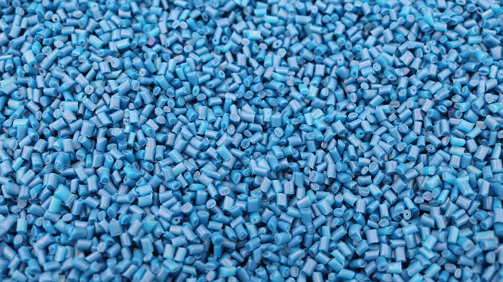
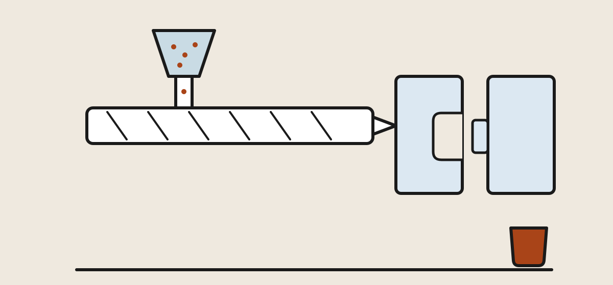
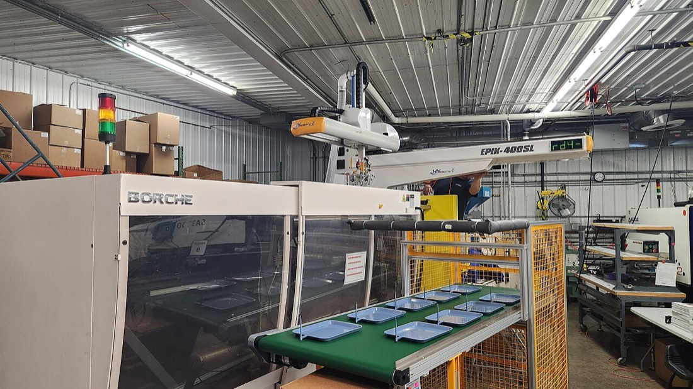
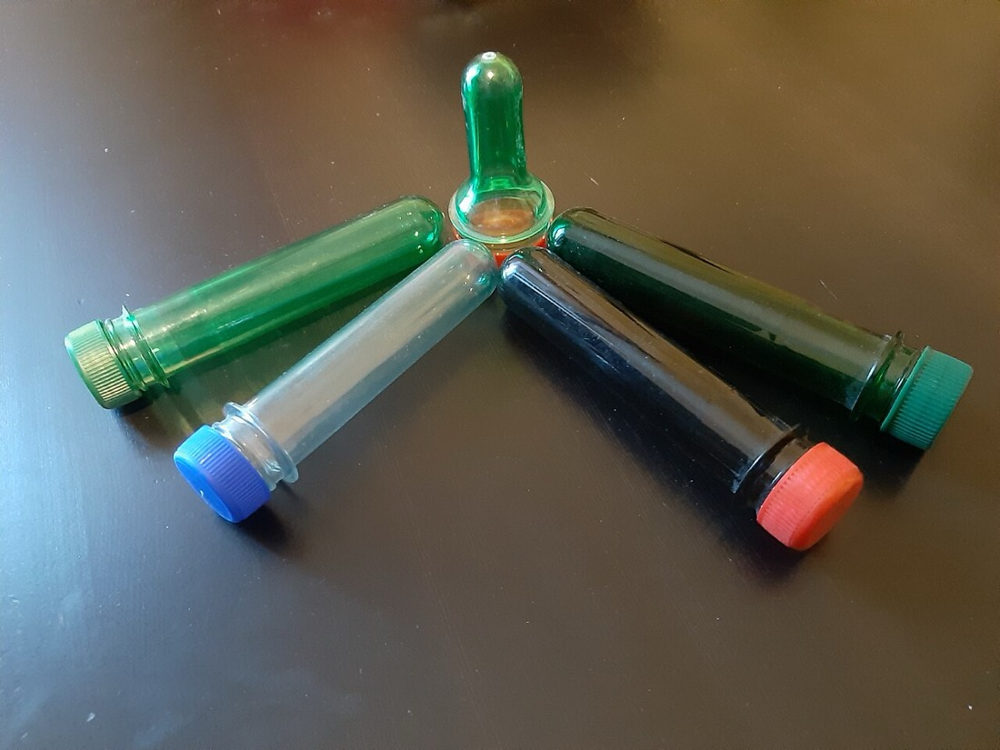
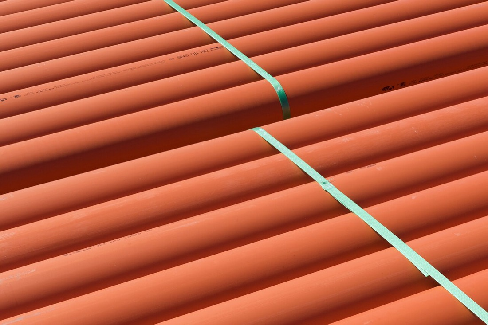
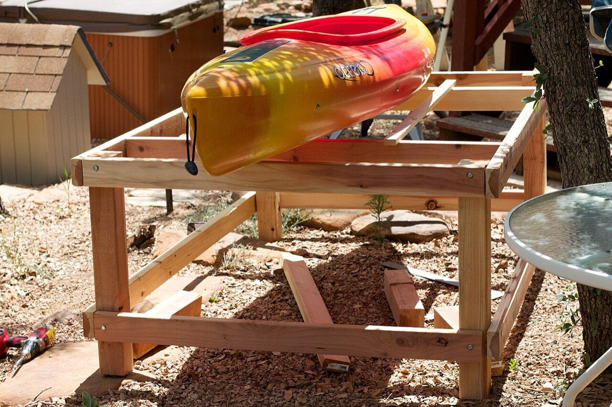

## The factory in your hand {#factory-in-hand}

Chapter 1 taught you to name the material. This chapter teaches the
second reading: **how the object was made.** It's a surprisingly short
syllabus — five processes account for nearly every plastic thing you
own — and each process leaves fingerprints. Once you know them, a
bottle cap confesses the mold it came from, a milk jug shows you the
seam where it was pinched shut, and the difference between a good
container and a cheap one becomes visible instead of vague.

That last part is the practical payoff. "Quality" in plastic goods is
mostly *manufacturing* quality — wall consistency, clean molding,
honest material — and you can inspect all of it in the store aisle
once you know where to look.

## From well to pellet {#pellet}

<figure>
  
  <figcaption>Resin as it ships: rice-sized pellets, here colored factory blue. Every process in this chapter starts from a silo of these. Photo: <a href="https://commons.wikimedia.org/wiki/File:Pellet_azul.jpg">ISIPLAST</a> / Wikimedia Commons (CC BY-SA 4.0)</figcaption>
</figure>

The upstream story fits in two beats. **First beat:** oil and natural
gas are refined into small hydrocarbon molecules — ethylene, propylene
and their cousins — the monomers of Chapter 1. **Second beat:**
reactors chain those monomers into polymers, and the polymer is
extruded, chopped and shipped as rice-sized pellets. Every factory in
this chapter starts from a silo of those pellets; a raw resin like
polyethylene sells for roughly a dollar a pound, which is the quiet
reason plastic conquered the household.

The pellets are rarely pure polymer. Blended in are **additives**:
stabilizers against UV and heat, colorants, slip agents so parts eject
from molds, plasticizers when flexibility is the goal (PVC's story
from Chapter 1), and often **regrind** — reground scrap from the
factory's own trimmings, perfectly legitimate in moderation and one of
the quality tells covered below. Additives are also why "what plastic
is this?" never fully answers "what's in this?" — a thread
[Chapter 3's safety section](plastics-field-guide.html#safety) picks
up.

## Injection molding: the king {#injection}

<figure>
  
  <figcaption>Melt in, part out, every few seconds. The mold splits along the parting line; the ejector pins that push the part free leave their little circles behind. Illustration: Makers Manual</figcaption>
</figure>

**Makes:** bottle caps, food-container bodies and lids, cutlery, toys,
toothbrush handles, appliance and tool housings, LEGO bricks — any
solid, precise shape, which is to say most plastic objects on Earth.

The process: pellets feed a heated screw that melts and rams the
polymer into a **steel mold** — two machined halves clamped together
with tons of force — where it cools into shape in seconds and is
pushed out by ejector pins so the cycle can repeat. A busy mold makes
a part every few seconds for years.

The economics explain half the plastic world: the *machine* is
ordinary, but the *mold* is a five-to-six-figure block of precision
steel. Tooling for a simple cap might run $10,000; a multi-cavity
mold for an appliance shell, well past $100,000. That's why injection
molding only makes sense at volume, why product redesigns are rare
and deliberate, and why "cheap plastic junk" and "superb plastic
engineering" can come off the same kind of machine — the difference
was paid for in the steel.

<figure>
  
  <figcaption>The real thing: clamp and mold at left, fresh trays riding out on the conveyor, the overhead robot pulling each shot so the next can start seconds later. Photo: <a href="https://commons.wikimedia.org/wiki/File:Injection_Molding_Machine_with_a_robot_arm.jpg">The robotic engineer1</a> / Wikimedia Commons (CC BY-SA 4.0)</figcaption>
</figure>

**Its signature, on every part you own:**

- the **parting line** — a fine seam where the mold halves met,
  running right around the part;
- the **gate mark** — a small dot or stub where the melt entered,
  often hidden under a label or inside a cap;
- **ejector-pin circles** — shallow ghost rings, usually on the
  unseen face, where the pins pushed the part free.

Find those three on a bottle cap and you've read your first object.

## Blow molding: everything hollow {#blow}

<figure>
  
  <figcaption>PET pre-forms, exactly as described: thick-walled test tubes with the bottle's finished threads already on them, waiting to be reheated, stretched and blown. Photo: <a href="https://commons.wikimedia.org/wiki/File:20220807_PET_preform_2.jpg">Wikimedia Commons</a> (CC0)</figcaption>
</figure>

**Makes:** every bottle and jug in the house — plus watering cans,
fuel cans and coolers' liners.

Hollow shapes can't be injection molded (there'd be no way to get a
core out), so bottles are *inflated*: a molten tube or pre-form is
clamped in a mold and blown up with air like a balloon until it takes
the mold's shape. Two variants dominate, and you can tell them apart
in your recycling bin:

- **Extrusion blow molding** — a molten tube of HDPE is pinched shut
  at the bottom and inflated. It leaves the **pinch-off seam**: the
  ridged line across the bottom of every milk jug and detergent
  bottle.
- **Injection stretch blow molding** — a PET **pre-form** (it looks
  like a thick-walled test tube with the finished threads already on
  it) is injection molded first, then reheated, stretched and blown.
  It leaves the **gate nub**: that little dot dead-center in the base
  of every soda bottle. The stretching also aligns PET's chains,
  which is where the bottle's carbonation-holding strength comes
  from — the athlete of Chapter 1 is *made* athletic by this step.

Seam across the bottom: extrusion blow, almost certainly HDPE. Dot in
the middle: stretch blow, almost certainly PET. You now know the
material of every bottle without reading the triangle.

## Extrusion: the endless profile {#extrusion}

<figure>
  
  <figcaption>Extrusion's whole idea in one photo: a cross-section repeated forever, cut to length and banded — with the spec printed continuously along each profile. Photo: <a href="https://commons.wikimedia.org/wiki/File:Orange_plastic_pipes.jpg">W.carter</a> / Wikimedia Commons (CC0)</figcaption>
</figure>

**Makes:** pipe, house siding, window frames, wire insulation, garden
hose, weatherstripping — and, via a variant, every film and bag.

Where injection molding makes discrete parts, extrusion makes
**continuous ones**: the screw pushes melt through a shaped die and an
unending profile of that cross-section emerges, cooled, and is cut to
length. It's the cheapest process per pound — no cycle, no clamping,
just flow — which is why construction plastics (PVC's home turf) are
all extruded.

The film variant is worth knowing because its products fill your
kitchen drawers: in **blown film** extrusion, molten polyethylene is
extruded as a thin tube and inflated into a bubble stories tall, then
collapsed flat and wound up. Grocery bags, produce bags, trash liners
and cling film are all that bubble, slit and sealed. A bag's strength
has a grain to it — stretch one lengthwise and crosswise and you'll
feel the difference — because the bubble stretched the molecules more
one way than the other.

## Thermoforming: the shaped sheet {#thermoforming}

<figure>
  
  <figcaption>Thermoforming at its most precise: one heated sheet, one vacuum-formed pocket per pill, and a foil lid — the same process, coarser, makes your yogurt cup. Photo: <a href="https://commons.wikimedia.org/wiki/File:Pills_in_blister_pack.jpg">Wikimedia Commons</a> (CC0)</figcaption>
</figure>

**Makes:** yogurt cups, clamshell takeout boxes, blister packs, meat
trays, disposable drink-cup lids, refrigerator door liners.

Thermoforming skips molten plastic entirely: a **sheet** of plastic is
warmed until rubbery, then sucked or pressed down over a mold and
trimmed. Tooling is cheap (the mold sees no pressure to speak of), the
cycle is fast, and the walls come out *thin* — which is the whole
point for packaging that exists for one lunch.

Its signature is **uneven thickness**: the sheet stretches most where
it travels farthest, so corners and deep draws are thinnest. Squeeze a
yogurt cup's rim, then its base corner — the corner gives first.
That's not a defect, it's the process; but it's also why thermoformed
packaging buckles if you ask it to do container duty twice, and why
Chapter 3 files it firmly under "single use, then bin." Many food
plants run **form-fill-seal** lines that thermoform the cup, fill it
and lid it in one machine — your yogurt was packaged seconds after
its container existed.

## Rotomolding: the gentle giant {#rotomolding}

<figure>
  
  <figcaption>A rotomolded kayak: one seamless polyethylene piece, no gate, no parting flash — even the red-to-yellow swirl is the rotating mold blending its powder. Photo: <a href="https://commons.wikimedia.org/wiki/File:2009-365-186_Alan%27s_Kayak_Rack_(3691762657).jpg">cogdogblog</a> / Wikimedia Commons (CC BY 2.0)</figcaption>
</figure>

**Makes:** coolers, kayaks, big storage bins, water tanks, playground
equipment, traffic barriers.

For large hollow things, blow molding runs out of road. **Rotational
molding** solves it slowly: powdered polyethylene goes into a closed
mold that is heated *while rotating on two axes*, so the melting
powder coats the interior evenly; cooled, it yields a one-piece,
seamless, stress-free hollow part with no gate, no parting flash and
walls of remarkably even thickness. The cycle takes minutes to
hours — the opposite of injection molding's seconds — but the tooling
is cheap and the parts are nearly indestructible, which is why every
premium cooler is rotomolded and says so in its marketing.

**Its signature:** a slightly pebbly matte surface, no seams or gate
marks anywhere, and a solid, even heft. If a large hollow object feels
like one continuous material with no thin spots — it was rotomolded.

## Reading quality off the process {#quality-tells}

Now the payoff. Manufacturing defects are visible, and each one tells
you the factory was cutting a specific corner:

- **Sink marks** — shallow dimples on a flat face, usually opposite an
  internal rib. The part was pulled from the mold before it finished
  cooling. Cosmetic on a bin; a warning on anything precise.
- **Flash** — thin fins of plastic along the parting line. A worn or
  poorly clamped mold. On cheap toys, flash edges can be sharp.
- **Short shots** — rounded-off, incomplete details where melt didn't
  fill the mold. Common on the deepest features farthest from the gate.
- **Weld lines** — faint seams where two melt fronts met and fused
  imperfectly; the part will crack there first.
- **Regrind specks** — flecks or streaks of off-color in the surface:
  heavy use of reground scrap. Fine in a flowerpot, a red flag in a
  food container.
- **Wall consistency** — the master tell. Squeeze; good parts flex
  evenly, cheap ones have soft spots where the wall thins. In
  thermoformed goods some thinning is inherent (see above), so judge
  those by their corners.

And a note on **recycled content**, to keep the tells honest: parts
molded from post-consumer resin often carry a slight gray or green
cast and a matte surface, and that is *not* a defect — it's the
material Chapter 4 works so hard to create, doing its second tour.
The distinction to draw is deliberate, labeled recycled content
versus anonymous specks in something meant to touch food.

## The five at a glance {#process-table}

  <table class="compare">
    <thead>
      <tr>
        <th>Process</th>
        <th>Makes</th>
        <th>Tooling cost</th>
        <th>The tell</th>
      </tr>
    </thead>
    <tbody>
      <tr>
        <td><strong>Injection molding</strong></td>
        <td>Solid precise parts: caps, containers, toys, housings</td>
        <td>Very high</td>
        <td>Parting line, gate dot, ejector-pin circles</td>
      </tr>
      <tr>
        <td><strong>Blow molding</strong></td>
        <td>Bottles and jugs</td>
        <td>High</td>
        <td>Pinch-off seam (HDPE) or base gate nub (PET)</td>
      </tr>
      <tr>
        <td><strong>Extrusion</strong></td>
        <td>Pipe, siding, profiles; films and bags (blown)</td>
        <td>Moderate</td>
        <td>Constant cross-section; film has a strength grain</td>
      </tr>
      <tr>
        <td><strong>Thermoforming</strong></td>
        <td>Cups, clamshells, blister packs, trays</td>
        <td>Low</td>
        <td>Thin, uneven walls — thinnest at corners</td>
      </tr>
      <tr>
        <td><strong>Rotomolding</strong></td>
        <td>Large hollow goods: coolers, kayaks, tanks</td>
        <td>Low</td>
        <td>Seamless, pebbly, even-walled; no gate anywhere</td>
      </tr>
    </tbody>
  </table>

*Tooling costs are relative orders of magnitude, not quotes — a
"cheap" rotomold still costs more than your kayak.*

---

**Next in this section:** with the materials named and the processes
readable, Chapter 3 walks the whole house — every product category,
which plastic it's made from, what quality looks like, and the honest
safety rules for food, microwaves and dishwashers.
[The Field Guide: What's Made of What →](plastics-field-guide.html)

## Terms you'll hear {#glossary}

- **Mold / tooling** — the machined steel negative a part is formed in; the dominant cost of injection molding.
- **Parting line** — the seam on a part where the mold halves met.
- **Gate** — the point where molten plastic entered the mold; leaves a dot or stub.
- **Ejector pins** — pins that push a cooled part out of the mold; leave shallow circles.
- **Pre-form** — the injection-molded "test tube" that is stretched and blown into a PET bottle.
- **Pinch-off** — the seam where extrusion blow molding squeezes the molten tube shut; the line on a jug's base.
- **Die** — the shaped opening extrusion pushes melt through, defining the profile's cross-section.
- **Blown film** — film made by inflating an extruded tube into a huge thin-walled bubble; bags and liners.
- **Regrind** — factory scrap reground and blended back into the resin feed.
- **Flash / sink mark / short shot / weld line** — the four classic molding defects: parting-line fins, cooling dimples, unfilled detail, and fused melt-front seams.

## References {#references}

1. British Plastics Federation, [Plastics processes](https://www.bpf.co.uk/plastipedia/processes/default.aspx) — clear, illustrated overviews of every process in this chapter.
2. Wikipedia: [Injection moulding](https://en.wikipedia.org/wiki/Injection_moulding), [Blow molding](https://en.wikipedia.org/wiki/Blow_molding), [Thermoforming](https://en.wikipedia.org/wiki/Thermoforming), [Rotational molding](https://en.wikipedia.org/wiki/Rotational_molding), [Plastic extrusion](https://en.wikipedia.org/wiki/Plastics_extrusion) — deeper mechanics and history for each.
3. Protolabs, [Injection molding design guidelines](https://www.protolabs.com/resources/design-tips/) — a manufacturer's own rules on gates, ejector pins, sink and draft; excellent for seeing the tells from the designer's side.
4. American Chemistry Council, [How plastics are made](https://www.americanchemistry.com/chemistry-in-america/chemistry-in-everyday-products/plastics) — the monomer-to-resin upstream story.
{: .references}

*Links accessed September 2026. Tooling figures are typical US ranges
and vary enormously with size, cavities and steel. Photographs are
from Wikimedia Commons under the licenses noted in their captions.*
