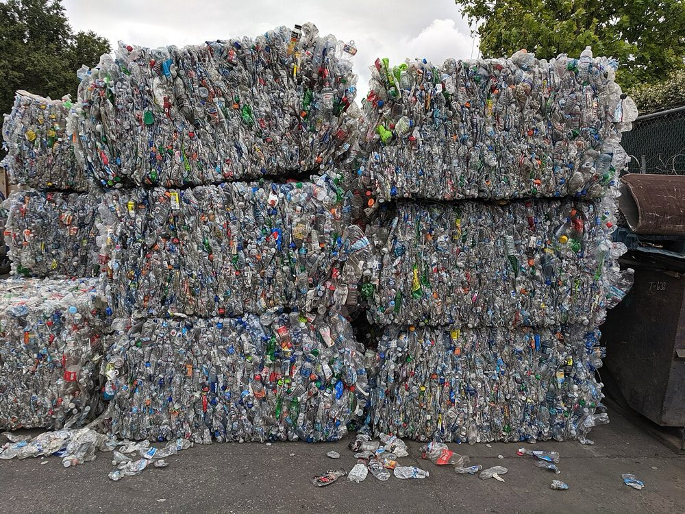
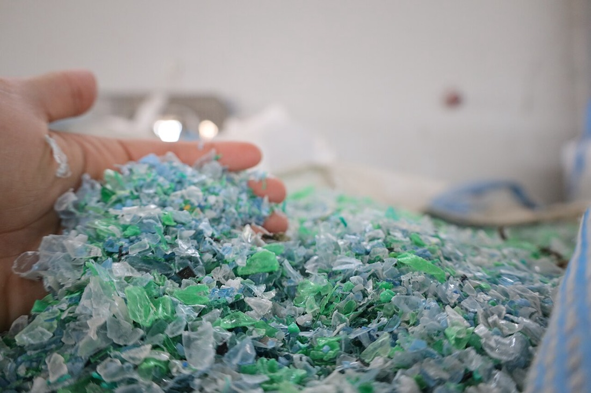

## The two survivors {#two-survivors}

[Chapter 4](plastics-recycling.html#which-recycle) ended with an
uncomfortable table: of the seven codes, only **PET** and **HDPE**
ride the recycling system all the way back to raw material at real
scale. This chapter is about what "all the way back" actually means.
The plant that does it is called a **reclaimer**, it buys bales by
the ton and sells pellets by the ton, and everything between its
receiving dock and its shipping dock exists to close a brutal purity
gap: a good MRF bale is perhaps 90–95 % the polymer on its label,
and a factory buying recycled pellet expects better than 99 %.

Why these two polymers, one more time, because the whole plant is
built on it: they arrive in **large, identical, clean-ish units**
(bottles and jugs), they're easy to identify by machine, their
densities sit on opposite sides of water — which hands the reclaimer
its best separation for free — and buyers exist for every ton of
output. Everything else in the bin fails at least one of those tests.

## Reading a bale: grades, specs and price {#bale-grades}

<figure>
  
  <figcaption>PET bales awaiting a buyer — each one a graded commodity with a spec sheet, and every stray color or vinyl bottle inside it a line item on the discount. Photo: <a href="https://commons.wikimedia.org/wiki/File:Bales_of_PET_bottles_stacked.jpg">Grendelkhan</a> / Wikimedia Commons (CC BY-SA 4.0)</figcaption>
</figure>

A bale is not just squashed bottles — it's a graded commodity with a
spec sheet, and the industry body APR publishes model specifications
that buyers hold sellers to. The grades you'd meet on a reclaimer's
dock:

- **PET bottle bales** — clear and light-blue bottles, caps on;
  specs cap the moisture, the "other PET" (thermoforms), and above
  all the contaminants measured in fractions of a percent.
- **Natural HDPE** — undyed milk and water jugs. The premium grade
  of the entire bin: uncolored resin can be dyed to anything, so it
  routinely prices far above its colored sibling.
- **Mixed-color HDPE** — detergent and shampoo bottles. Still
  valuable; destined for dark-colored second lives.

Price moves with oil (virgin resin is the competition), with bale
quality, and with policy — a deposit-state bale of clean PET is a
different product from a curbside bale with a summer's food waste in
it. The discount schedule for contamination is the economic engine
behind every rule in [Chapter 4's at-home list](plastics-recycling.html#at-home):
a moldy bale isn't an aesthetic problem, it's a price cut a buyer
can measure.

## Breaking the bale, sorting again {#debale-sort}

The line starts by undoing the MRF's last step: a **debaler** tears
the cube apart and meters bottles onto the belt in a single layer.
Then — and this surprises people — the reclaimer *sorts again*,
with the same weapons the MRF used: near-infrared optical sorters,
metal detection, and human eyes on a pre-sort deck. The MRF sorted
to make a sellable bale; the reclaimer sorts to protect a melt. The
targets now are the fraction of a percent the MRF let through: the
PVC bottle that looks like PET (the single worst offender, for
reasons § 6 makes vivid), the silicone-lined sports cap, the
multilayer juice bottle, the PET thermoform in an HDPE stream.

## Grind and wash: flake is born {#grind-wash}

<figure>
  
  <figcaption>Washed PET flake, the plant's working currency. The blue-green mix is honest — this batch hasn't met § 6's color sorters yet. Photo: <a href="https://commons.wikimedia.org/wiki/File:FLAKES.jpg">TOP PLASTIC</a> / Wikimedia Commons (CC BY-SA 4.0)</figcaption>
</figure>

Sorted bottles feed a **granulator** — a drum of flying knives —
and come out as **flake**, roughly fingernail-sized, often ground
wet to keep dust down and knives cool. Flake is the working form
for everything that follows: it washes better than bottles, sorts
better than bottles, and melts more evenly than bottles.

Then the heart of the plant: the **hot wash**. Flake tumbles
through agitated tanks of hot water — around 85 °C — dosed with
caustic soda and detergent, which strips label adhesive, dissolves
the last of the soda, saponifies grease, and scrubs off the
summer's biology. High-friction washers rub the flakes against
each other; rinse stages carry away the chemistry; the plant's
water loops through its own treatment because a reclaimer is, in
large part, a laundry. What leaves the wash line is clean flake
plus a stream of sludge, labels and glue that quantifies exactly
how dirty the inbound bales were.

## The float-sink tank, in full {#float-sink}

Now the trick this section has been promising since
[Chapter 1's float test](plastics-explained.html#identify). The
washed flake — bottle, cap and label ground together — pours into
a water tank, and the materials sort *themselves*:

- **PET flake sinks.** Density ~1.38 — well over water.
- **Cap and ring flake floats.** The PP and HDPE of closures sit
  at 0.90–0.96 — under water's density, every time.

One quiet tank undoes what no machine upstream could: it separates
materials that were mechanically inseparable as objects. This is
why caps-on was the right rule all along — the cap was never a
contaminant, just a passenger traveling to its own exit. On an
HDPE line the same physics runs in mirror image: polyolefin flake
floats off the top while PVC, PET and metal stragglers sink away
from it. **Elutriators** — rising air columns — do the same job in
air, lifting away film scraps and label fines too light for the
tank.

The floated polyolefin from a PET line isn't waste, by the way:
collected across a year, a bottle reclaimer's cap stream is its own
salable product — recycled PP with a business model made of lids.

## Polishing the flake: optical sorters and the PVC problem {#flake-polish}

Clean, single-polymer flake still isn't pellet-ready. Flake-scale
**optical sorters** — cameras and NIR heads over fast belts, air
jets underneath — fire out individual flakes that are the wrong
color or the wrong polymer; metal detectors eject anything
conductive down to fragments. For clear PET, color sorting is
money: every green flake that escapes into a clear stream tints
the batch toward the gray-green that buyers discount.

And here is where PVC earns the dread this section keeps assigning
it. PET melts at processing temperatures around 270 °C; PVC starts
decomposing far below that, shedding hydrochloric acid and burning
into black specks. The tolerances are measured in **parts per
million** — double-digit ppm of PVC can degrade a PET melt, etch
equipment, and spot an entire production run. One mis-sorted
shampoo-bottle's worth of vinyl flake, in other words, can spoil a
batch weighing tons — which is why a reclaimer runs redundant
sorting passes and why [Chapter 4](plastics-recycling.html#which-recycle)
called PVC "actively unwanted" rather than merely unrecycled.

## Melt, filter, pellet {#melt}

The finished flake finally meets heat — carefully. PET must be
**dried hard** first (down to tens of ppm of moisture), because
water at melt temperature hydrolyzes the polymer and chops chain
length. An extruder melts the flake; **melt filtration** forces the
stream through fine screens that catch the last specks — paper
fibers, char, the odd survivor — with automatic screen changers
swapping filters without stopping the line; vacuum **degassing**
pulls off volatiles and the residues of flavors past. The clean
melt is cut into pellets, and the output bins hold something a
molder can buy: **rPET** and **rHDPE**, the PCR resin that
[Chapter 2's factories](plastics-manufacturing.html#pellet) blend
into new products.

## PET's extra mile: IV, SSP and food grade {#pet-food-grade}

For PET, pellets alone aren't the summit. Two upgrades separate
"recycled PET" from "PET a bottling plant will accept":

**Chain length.** Bottle-grade PET is specified by **intrinsic
viscosity (IV)** — a proxy for how long its molecular chains are —
and every trip through a melt clips chains and drops IV below what
a stretch-blow machine needs. The repair is elegant:
**solid-state polycondensation (SSP)**. Hold the pellets for hours
just *below* melting, under vacuum or flowing inert gas, and the
polymer quietly resumes the chemistry that built it, relinking
chains and raising IV back to bottle grade. No new material — just
time, heat and patience un-doing the damage of the recycling loop.

**Cleanliness.** Food-contact rPET must be decontaminated to
regulator satisfaction — the same SSP time-at-temperature doubles
as a "super-clean" step that bakes out absorbed substances, and
processes are validated by spiking test resin with worst-case
contaminants and proving the process removes them. In the US the
FDA reviews each process and issues a **letter of no objection**;
that letter is what lets the phrase "made with recycled content"
appear on a bottle that touches what you drink. This is the
machinery behind [Chapter 4's closed loop](plastics-recycling.html#reclaimer):
bottle-to-bottle is real, and this is the extra mile it runs.

## HDPE's own line: color, smell and second lives {#hdpe-path}

The HDPE plant runs the same skeleton — debale, sort, grind, hot
wash, float (HDPE rides the top of the tank), sort, extrude — with
its own emphases. **Color rules everything:** natural flake keeps
its premium only if colored strays are sorted out relentlessly,
while the mixed-color stream is destined for black and gray
products where dye history doesn't show. **Odor is the stubborn
enemy:** milk residue and detergent perfumes soak into polyolefin
and survive washing, so HDPE lines lean on hot-air deodorizing,
degassing extruders and sometimes steam stripping — and still, most
rHDPE goes to lives where a faint history doesn't matter. Which is
the third emphasis: **markets.** Natural rHDPE genuinely returns
to bottles (food-grade rHDPE exists, though its approval path is
harder than PET's); colored rHDPE becomes detergent bottles with
stated PCR content, pipe, buckets, and the plastic lumber of
[Chapter 3's outdoor furniture](plastics-field-guide.html#hdpe-products) —
long-lived products that park the material for decades.

## The ledger: yield, quality, economics {#ledger}

What does the whole line add up to? Three honest numbers close the
chapter:

  <table class="compare">
    <thead>
      <tr>
        <th></th>
        <th>PET line</th>
        <th>HDPE line</th>
      </tr>
    </thead>
    <tbody>
      <tr>
        <td><strong>In the tank</strong></td>
        <td>Sinks (1.38)</td>
        <td>Floats (0.95)</td>
      </tr>
      <tr>
        <td><strong>Signature extra step</strong></td>
        <td>Drying + SSP to rebuild IV, food-grade decontamination</td>
        <td>Color segregation, deodorizing</td>
      </tr>
      <tr>
        <td><strong>Typical bale-to-pellet yield</strong></td>
        <td>~70–75 %</td>
        <td>~75–85 %</td>
      </tr>
      <tr>
        <td><strong>Worst enemy</strong></td>
        <td>PVC at ppm levels; moisture at the extruder</td>
        <td>Odor carryover; color contamination of natural</td>
      </tr>
      <tr>
        <td><strong>Best output</strong></td>
        <td>Food-grade clear rPET, bottle to bottle</td>
        <td>Natural rHDPE back to bottles; colored to pipe and lumber</td>
      </tr>
    </tbody>
  </table>

*Yields are typical industry ranges for decent curbside bales;
deposit-system bales run higher, badly contaminated ones lower.*

The missing quarter of the PET bale is the honest cost of the first
life: caps and labels (recovered separately), moisture, dirt,
mis-sorts and fines. And the economics stay humble — a reclaimer's
pellet competes every day with virgin resin whose price it doesn't
control, which is why the demand side of
[Chapter 4's list](plastics-recycling.html#what-works) — actually
*buying* products with recycled content — is what keeps these
plants running. The bin fills the dock; the shopping cart empties
it.

---

**Elsewhere in this section:** this chapter zoomed into one room of
[Chapter 4's recycling story](plastics-recycling.html) — for the
polymers themselves start at
[Chapter 1](plastics-explained.html), and for where the pellets go
next, [Chapter 2's factories](plastics-manufacturing.html) are
waiting for them.

## Terms you'll hear {#glossary}

- **Reclaimer** — the plant that converts sorted bales into recycled resin pellets.
- **Debaler** — the machine that tears bales apart and meters containers onto the line.
- **Flake** — ground container material, the working form through washing and sorting.
- **Hot wash** — agitated ~85 °C caustic-and-detergent wash that strips glue, labels and food.
- **Float-sink (sink-float) tank** — density separation in water; PET sinks, polyolefins float.
- **Elutriation** — separation in a rising air column; lifts away film and label fines.
- **Melt filtration** — forcing molten polymer through fine screens to catch final impurities.
- **IV (intrinsic viscosity)** — the chain-length spec that defines bottle-grade PET.
- **SSP (solid-state polycondensation)** — hours just below melting that relink PET chains and decontaminate.
- **PCR (post-consumer resin)** — the finished product: recycled pellet sold to manufacturers.
- **Letter of no objection** — FDA's sign-off that a recycling process yields food-contact-safe resin.
- **Natural HDPE** — undyed HDPE (milk jugs), the premium bale grade because it accepts any color.

## References {#references}

1. Association of Plastic Recyclers, [Model bale specifications](https://plasticsrecycling.org/model-bale-specs) and [APR Design® Guide](https://plasticsrecycling.org/apr-design-guide) — the bale grades, contaminant limits and design-for-recycling rules this chapter's specs come from.
2. US FDA, [Recycled plastics in food packaging](https://www.fda.gov/food/packaging-food-contact-substances-fcs/recycled-plastics-food-packaging) — the letter-of-no-objection process behind food-grade rPET and rHDPE.
3. NAPCOR, [PET recycling reports](https://napcor.com/reports-resources/) — annual US PET collection, reclamation capacity and rPET end-market data.
4. Wikipedia, [PET bottle recycling](https://en.wikipedia.org/wiki/PET_bottle_recycling) — a solid technical walkthrough of wash lines, sink-float, SSP and super-clean processes, with literature.
5. Plastics Recyclers Europe, [HDPE recycling](https://www.plasticsrecyclers.eu) — the European view of the same lines, including odor and color management.
6. US EPA, [Plastics: Material-Specific Data](https://www.epa.gov/facts-and-figures-about-materials-waste-and-recycling/plastics-material-specific-data) — the collection-rate context these plants operate in.
{: .references}

*Links accessed September 2026. Temperatures, tolerances and yields
are typical industry figures — individual plants and specs vary.
Photographs are from Wikimedia Commons under the licenses noted in
their captions.*
