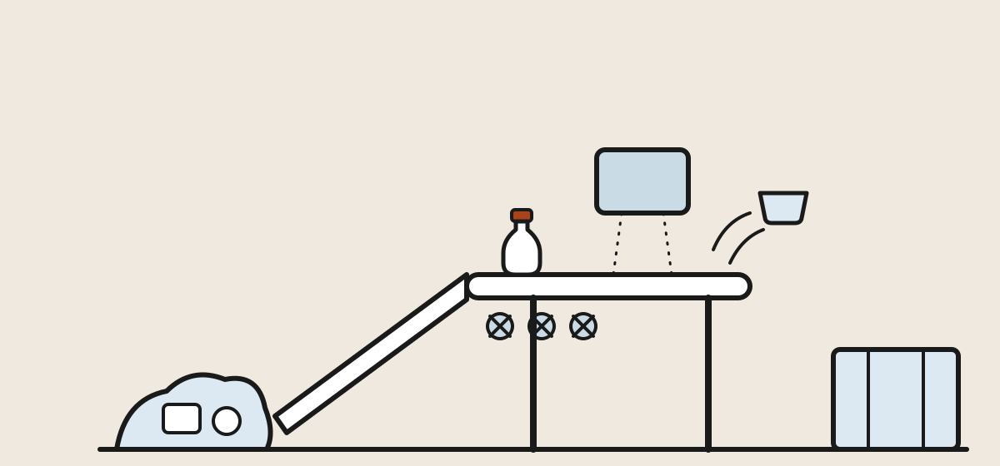

## The arrows never promised {#arrows}

Start with the uncomfortable history, because it explains everything
downstream. The chasing-arrows resin code from
[Chapter 1](plastics-explained.html#codes) was introduced by the
plastics industry in 1988 as an *identification* mark — but stamped
inside the universal recycling symbol, on every plastic including the
ones nobody has ever recycled at scale. Internal industry documents
unearthed by journalists in 2020 showed the ambiguity wasn't an
accident: the industry understood that a public who believed plastic
was recyclable would keep buying it, even as its own engineers doubted
most of it ever would be.

The result is the gap this chapter maps: a public that reads
"triangle = recyclable," and a recycling system for which that has
never been close to true. The regulatory tide is turning —
California now restricts the arrows on products that aren't actually
recyclable there, and the FTC's Green Guides require "recyclable"
claims to reflect what most consumers' programs really accept — but
the mark on the bottom of your tub still means only what Chapter 1
said: *this is what it's made of.* Nothing more.

## Follow the tub: from cart to bale {#mrf}

<figure>
  
  <figcaption>The MRF in one line: screens throw out the flat things, magnets and eddy currents take the metals, and near-infrared eyes puff each polymer off the belt with a jet of air. Illustration: Makers Manual</figcaption>
</figure>

Your bin's contents ride to a **materials recovery facility** — a
MRF, rhymes with "smurf" — whose entire business is unmixing what
your household mixed. The line runs like this:

1. **The tipping floor.** Trucks dump; loaders push the pile onto the
   first conveyor. Workers pull out the disasters — propane tanks,
   Christmas lights, garden hoses. (Hoses and cords are **tanglers**:
   they wrap the spinning equipment and stop the plant. Remember
   them; they set one of the rules at the end.)
2. **Screens.** Spinning rubber-starred discs float flat cardboard
   and paper up and over while containers tumble through. This is
   also where plastic *bags* fail the system — film wraps the
   star shafts, and crews shut the line down daily to cut it free.
   Shape, not chemistry, is film's whole problem.
3. **Metals leave.** A magnet lifts steel; an **eddy-current
   separator** flips a repelling magnetic field on and aluminum
   cans literally jump off the belt.
4. **The optical sorters** — the stars of the modern MRF. A
   **near-infrared (NIR)** camera reads each object's polymer from
   its reflected light signature (the same identification you did by
   feel in Chapter 1, at belt speed), and a precisely timed air jet
   puffs the chosen object into its bunker: PET here, HDPE there,
   PP if the plant sorts it. NIR has one famous blind spot — carbon-
   black plastic absorbs the signal, which is why black takeout
   trays so often die at this step even when their polymer is fine.
5. **The bale.** Each polymer bunker feeds a baler that crushes the
   haul into half-ton cubes. The bale is the MRF's product, sold by
   the ton, graded by purity — a PET bale with PVC bottles hiding in
   it sells at a discount or not at all, because (Chapter 1 again)
   chlorine wrecks the remelt.

## Bale to pellet: the reclaimer {#reclaimer}

The bale's buyer is a **reclaimer**, and its plant finishes the job.
The bale is broken and ground into **flake**; the flake takes a hot
caustic wash that strips labels, glue and food; and then comes the
elegant trick promised in Chapter 1 — the **float-sink tank**. PET
sinks; the PP and HDPE of caps and rings float. One tank of water
separates bottle from cap, which is exactly why the old
"remove the caps" advice died: **leave caps on** — screwed on, they
travel with the bottle and get separated automatically, while a loose
cap is too small for the MRF's screens and falls through to the
landfill.

Clean, sorted flake is melted, filtered and extruded into pellets —
**PCR**, post-consumer resin — which re-enters
[Chapter 2's](plastics-manufacturing.html#pellet) factories like any
other pellet. The catch that shapes everything: each remelt clips
polymer chains shorter, and dyes ride along, so recycled resin is
usually a *downgrade* — slightly weaker, never clearer. Clear PET
bottles can become bottles again (**closed loop**) a limited number
of times; more often the flake becomes polyester fiber for carpet
and fleece — real reuse, but a one-way trip, because nobody recycles
a carpet. That one-way staircase is **downcycling**, and it's the
honest description of most plastic recycling that happens at all.

*This section compressed a whole factory into three paragraphs —
[Chapter 5](plastics-reclaiming.html) walks the reclaimer's line end
to end, wash tanks, sink-float and all.*

## Which plastics actually make it {#which-recycle}

Now Chapter 1's cast, sorted by their real fates:

  <table class="compare">
    <thead>
      <tr>
        <th>Plastic</th>
        <th>Really recycled?</th>
        <th>Why / why not</th>
      </tr>
    </thead>
    <tbody>
      <tr class="pick-row">
        <td><strong>PET (1) bottles</strong></td>
        <td>Yes — the flagship</td>
        <td>Huge clean supply, NIR-sortable, strong rPET demand for bottles and fiber</td>
      </tr>
      <tr class="pick-row">
        <td><strong>HDPE (2) bottles &amp; jugs</strong></td>
        <td>Yes</td>
        <td>Same virtues; natural (undyed) jugs are the premium grade</td>
      </tr>
      <tr>
        <td><strong>PP (5) tubs</strong></td>
        <td>Increasingly</td>
        <td>Sortable and valuable, but plants needed PP-specific lines; investment arrived in the 2020s</td>
      </tr>
      <tr>
        <td><strong>PVC (3)</strong></td>
        <td>No</td>
        <td>Chlorine poisons every other stream; actively unwanted in the bin</td>
      </tr>
      <tr>
        <td><strong>LDPE (4) film</strong></td>
        <td>Not curbside</td>
        <td>Chemistry fine, shape fatal — film jams the plant; store drop-off only</td>
      </tr>
      <tr>
        <td><strong>PS (6) &amp; foam</strong></td>
        <td>No</td>
        <td>Too light, too food-soiled, too worthless per truckload to collect</td>
      </tr>
      <tr>
        <td><strong>#7 / multilayer</strong></td>
        <td>No</td>
        <td>Mixed or fused materials can't be unmixed mechanically</td>
      </tr>
    </tbody>
  </table>

The pattern: recycling succeeds where a polymer arrives in **large,
clean, identical, sortable units** — bottles, basically — and fails
everywhere else. A chip bag laminating PET to aluminum to PE is
unrecyclable not from neglect but by construction; no mechanical
process unbakes that cake. That's also the honest reading of
"compostable" PLA from Chapter 1: it needs an industrial composter's
sustained heat, contaminates PET streams when the NIR misreads it,
and in a backyard pile survives for years.

## The numbers, plainly {#numbers}

The measured reality, so the rest of the chapter has scale:

- Of all plastic waste ever generated worldwide, roughly **9 % has
  been recycled**. About 12 % was incinerated; the rest is in
  landfills and the environment.
- The current US plastic recycling rate is in the single digits —
  around **5–9 %** depending on year and method. (Paper, for
  contrast, exceeds 60 %; aluminum cans, about 45 %.)
- Even the flagship performs modestly: about **a third** of US PET
  bottles are collected, and dramatically more in the ten states
  with **deposit returns** — a dime on the bottle roughly triples
  collection, the single most effective policy in the data.
- Recycled content in new plastic products remains under 10 %
  globally — virgin resin is usually cheaper, which is the economic
  headwind under everything above.

None of this argues the bin is pointless: a recycled PET bottle or
HDPE jug is a genuine, measured win — less energy, less virgin
resin, less landfill. The numbers argue something narrower: the bin
is a *specialist tool* that works brilliantly on a short list of
items, and the fastest way to improve it is to stop feeding it
everything else.

## Chemical recycling: promise and asterisks {#chemical}

Because mechanical recycling can't touch films, multilayers and mixed
scrap, the industry's hope is **advanced (chemical) recycling** —
undoing the polymer itself:

- **Pyrolysis** cooks mixed polyolefins (PE, PP) without oxygen back
  into a synthetic crude oil that can re-enter production. It
  tolerates dirty, mixed feedstock — its great virtue — but is
  energy-hungry, and much of its output historically became fuel
  (burned once) rather than new plastic.
- **Depolymerization** unzips PET back to its monomers, which can be
  repolymerized into *virgin-quality* PET — colored and fiber PET
  included, which mechanical recycling can't upgrade. Commercial
  plants exist today; it's the most credible of the family.
- **Enzymatic recycling** — engineered PET-eating enzymes doing the
  same unzipping in warm water — has moved from lab celebrity to
  first industrial plants and is worth watching.

The honest summary: chemical recycling is real, useful and growing —
and it currently handles well under one percent of plastic waste,
after two decades of announcements. Treat it as a genuine future
supplement, not a reason to feel fine about the clamshell today. It
is also, fairly noted, the industry's favorite argument against
regulation, which is a reason to watch the tonnage rather than the
press releases.

## Doing it right at home {#at-home}

Everything above compresses into a short list. The theme:
**a clean bale is the goal, and your bin is the first sorting step.**

1. **Bottles, jugs and (where accepted) tubs — always.** PET and
   HDPE bottles are the system's success story; don't let the
   gloom above keep its best inputs out.
2. **Caps on.** Screwed onto the empty bottle — the float-sink tank
   separates them; loose caps fall through the screens.
3. **Empty, quick rinse, dry-ish.** Food residue degrades the bale
   (and one moldy container can spoil a load's grade). Spotless
   isn't required; empty is.
4. **No bags, no film, no tanglers.** Bags jam the screens; hoses
   and cords stop the plant. Bag drop-off bins at grocery stores
   are the film route where they exist — and never put your
   recyclables *inside* a trash bag; bagged loads get landfilled
   unopened at many MRFs.
5. **No wish-cycling.** Tossing the dubious thing in "just in case"
   feels virtuous and does harm — sorting costs, contaminated
   bales, jammed machines. When in doubt, throw it out (or better,
   check your hauler's actual list once; it's usually one page).
6. **Ignore the triangle, obey the local list.** Your program's
   accepted-items list is the only document that describes reality
   at your curb. The triangle describes chemistry.
7. **Buy the loop closed.** Recycling only works if someone buys
   the result: choosing bottles and bins labeled with real
   post-consumer content is the demand side of everything above.

## Microplastics: the open file {#microplastics}

No honest recycling chapter ends without the newer problem.
**Microplastics** — fragments under 5 mm — now turn up everywhere
science has looked: seafloor, farm soil, drinking water, human blood
and placenta. Their main sources are not litter photogenically
breaking down but everyday attrition: **tire wear** (likely the
largest single source), **textile fibers** shed in laundry
(Chapter 1's polyester fleece is a prime shedder — a front-loader
and a filter bag help), paint dust and the slow UV-crumbling of
plastic already in the environment.

What's known: they're ubiquitous and accumulating. What's not, yet:
the human health effect — plausible mechanisms and early findings,
no established dose-harm relationship. We flag it here because it
reframes the section's whole arc: the material's durability, its
virtue in every chapter, is also the reason every fragment persists.
Prevention beats cleanup by an enormous margin, which is the note
this section ends on.

## What actually moves the needle {#what-works}

Ranked by measured effect, the short honest list:

1. **Use less, reuse more.** The R's are ordered. A refilled PP
   container (Chapter 3's good one) outperforms any recycling
   outcome for the packaging it replaces.
2. **Deposit-return laws.** The one intervention that demonstrably
   triples bottle recovery. If your state debates one, that's the
   ballgame.
3. **Buy recycled content.** Demand pull — it's what makes the bale
   worth making.
4. **Recycle the short list, cleanly.** Bottles, jugs, accepted
   tubs, caps on — done right, per the rules above.
5. **Route the specials.** Film to store drop-off; electronics,
   which carry their plastics *and* metals, to e-waste collection —
   never the bin.

The material itself was never the villain of this section — Chapters
1 through 3 are a catalog of jobs plastic does better than anything
else, our own [home server's](home-server-vpn.html) ABS shell
included. The failure is treating a fifty-year material as a
five-minute one. Buy it where it's the right material, keep it in
service, and when it's truly done, you now know exactly which bin
tells the truth.

---

**Next in this section:** this chapter left the bale on the
reclaimer's dock. Chapter 5 follows it inside — the debaler, the hot
wash, the sink-float tank, and the chemistry that turns PET and HDPE
back into raw material a factory will buy.
[Bale to Pellet →](plastics-reclaiming.html)

## Terms you'll hear {#glossary}

- **MRF** — materials recovery facility; the sorting plant your bin's contents ride to. Rhymes with "smurf."
- **NIR sorting** — near-infrared optical identification of polymers on the belt, paired with air jets; blind to carbon-black plastic.
- **Eddy-current separator** — the repelling magnetic field that makes aluminum jump off the line.
- **Tangler** — hoses, cords, chains: anything that wraps the spinning equipment and stops the plant.
- **Bale** — the half-ton, single-polymer cube that is a MRF's sellable product.
- **Reclaimer** — the plant that turns bales into washed flake and then recycled pellets.
- **PCR** — post-consumer resin; recycled plastic re-entering manufacture as pellets.
- **Downcycling** — recycling into a lesser, unrecyclable product (bottle → carpet); the common case.
- **Closed loop** — recycling a product back into the same product (bottle → bottle); the rare, best case.
- **Wish-cycling** — binning non-recyclables "just in case"; actively harmful to the sort.
- **Depolymerization / pyrolysis** — chemical recycling: unzipping PET to its monomers, or cooking polyolefins back to oil.

## References {#references}

1. US EPA, [Plastics: Material-Specific Data](https://www.epa.gov/facts-and-figures-about-materials-waste-and-recycling/plastics-material-specific-data) — the official US generation and recycling figures by resin.
2. OECD, [Global Plastics Outlook](https://www.oecd.org/environment/plastics/) — the source of the global 9 % figure and the projections around it.
3. NPR / PBS Frontline, [Plastic Wars — "How Big Oil Misled The Public Into Believing Plastic Would Be Recycled"](https://www.npr.org/2020/09/11/897692090/how-big-oil-misled-the-public-into-believing-plastic-would-be-recycled) — the 2020 investigation behind the arrows history in § 1.
4. Association of Plastic Recyclers, [Recycling resources](https://plasticsrecycling.org) — the industry body behind caps-on guidance and bale-grade specifications.
5. The Recycling Partnership, [State of Recycling reports](https://recyclingpartnership.org) — US curbside capture data, including what share of recyclables never reaches the cart.
6. Container Recycling Institute, [Bottle bill resources](https://www.container-recycling.org) — the deposit-return data behind § 8's ranking.
7. FTC, [Green Guides](https://www.ftc.gov/news-events/topics/truth-advertising/green-guides) — what "recyclable" is legally allowed to mean on a US label.
8. Science, [Production, use, and fate of all plastics ever made (Geyer, Jambeck & Law, 2017)](https://www.science.org/doi/10.1126/sciadv.1700782) — the landmark accounting every number above descends from.
{: .references}

*Links accessed September 2026. Rates and program rules change and
vary by locality — your hauler's accepted-items list is the governing
document at your curb.*
