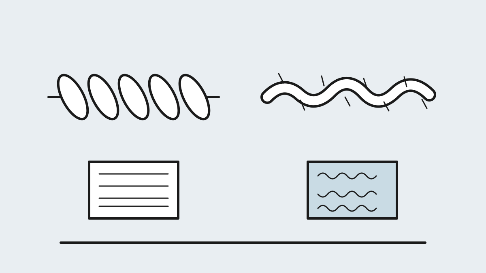
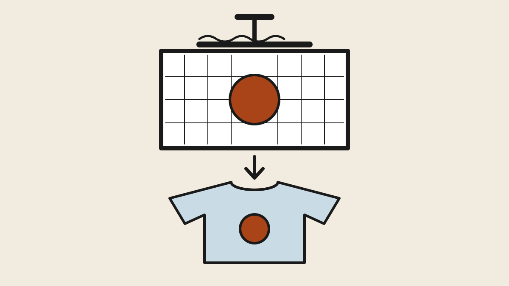

## Why the blank is half the product {#why-blanks}

A printed tee is two decisions, not one. The art gets all the attention, but
the **blank** — the undecorated shirt you print on — determines how the
product feels in the hand, how it drapes on a body, how it survives its tenth
wash, and what it costs you per unit. Customers can't see your margins and
rarely read your care label; what they remember is whether the shirt felt
cheap or felt like the ones they buy at retail.

The good news is that blanks are a solved, specced, commodity market. Every
shirt you'd consider is described by a handful of specs — fiber, weight, yarn
count, knit, construction — and once you can read them, a wholesale catalog
stops being a wall of numbers and becomes a menu. This chapter teaches you to
read the menu.

One warning before the details: fabric choice and printing method are not
independent decisions. Some methods only work on cotton, one only works on
polyester, and getting this wrong is the most expensive category of beginner
mistake. We'll come back to that in [the compatibility section](#printing).

## Fibers: cotton, polyester and the blends between {#fibers}

<figure>
  
  <figcaption>Ring-spun yarn is twisted smooth and fine; open-end yarn is wrapped and fuzzy. The difference is what your fingers read as "soft." Illustration: Makers Manual</figcaption>
</figure>

**Cotton** is the default for printed tees, but "100% cotton" tells you
almost nothing — the spec that matters is how the yarn was spun.
**Ring-spun** cotton is twisted and thinned as it's spun, producing a
softer, stronger, smoother yarn. **Open-end** (also called carded or
"regular") cotton is cheaper and coarser. Nearly every blank marketed as
"soft" or "premium" is ring-spun; nearly every scratchy giveaway shirt is
open-end. One step further up, **combed** cotton has its short fibers
removed before spinning, which cuts pilling and surface fuzz — *combed
ring-spun cotton* is the standard premium spec, and you'll see it
abbreviated CRS on spec sheets.

Above that sit the upgrades: **Pima and Supima** cotton use extra-long
staple fibers for a noticeably silkier hand at a noticeably higher price,
and **organic cotton** buys certification and a marketing story more than a
different feel.

**Polyester** is cotton's opposite: cheap, wrinkle-resistant, shrink-proof,
and moisture-wicking, but slicker to the touch and prone to holding odor.
Athletic and budget shirts lean on it heavily. It also has one strategic
property that matters even if you never plan to sell a poly tee: it is the
**only fiber that works for sublimation printing**, so a polyester blank
belongs in your plans if that method does.

**Rayon, modal, viscose and TENCEL** are semi-synthetics made from wood
pulp. They're what makes a shirt drapey, silky and cool to the touch — and
also weaker when wet, unpredictable in the wash, and more expensive. You'll
meet them mostly as the third ingredient in fashion blends.

**Blends** are where most of the market actually lives:

  <table class="compare">
    <thead>
      <tr>
        <th>Blend</th>
        <th>Character</th>
        <th>Notes</th>
      </tr>
    </thead>
    <tbody>
      <tr>
        <td><strong>50/50 cotton-poly</strong></td>
        <td>The workhorse</td>
        <td>Softer than carded cotton, less shrinkage, cheaper than premium cotton</td>
      </tr>
      <tr>
        <td><strong>Tri-blend</strong> (~50 poly / 25 cotton / 25 rayon)</td>
        <td>"Vintage soft," heathered color</td>
        <td>Fashion favorite; the uneven surface makes it harder to print cleanly</td>
      </tr>
      <tr>
        <td><strong>Cotton-spandex</strong></td>
        <td>Slight stretch</td>
        <td>A few percent elastane; common in women's fits</td>
      </tr>
    </tbody>
  </table>

## Weight: the first spec on every sheet {#weight}

Fabric weight is quoted in **ounces per square yard** in the US and **GSM**
(grams per square meter) elsewhere; roughly 34 grams equal one ounce. It's
the first number on every spec sheet, and it maps directly to how a shirt
reads:

  <table class="compare">
    <thead>
      <tr>
        <th>Range</th>
        <th>Feel</th>
        <th>Typical use</th>
      </tr>
    </thead>
    <tbody>
      <tr>
        <td>3.2–4.3 oz (110–145 gsm)</td>
        <td>Light, drapey, semi-sheer</td>
        <td>Fashion tees, women's fits</td>
      </tr>
      <tr>
        <td>4.5–5.5 oz (150–185 gsm)</td>
        <td>Standard mid-weight</td>
        <td>Most retail tees</td>
      </tr>
      <tr>
        <td>6.0–7.0+ oz (200–240 gsm)</td>
        <td>Heavy, structured, opaque</td>
        <td>Streetwear, workwear, premium boxy tees</td>
      </tr>
    </tbody>
  </table>

*Heavier isn't automatically better — it's a style decision. Heavyweight
boxy tees are the current streetwear uniform; lightweight tri-blends read
as "soft fashion brand." Pick the weight that matches the brand you're
building, not the biggest number.*

## Yarn count: the quality tell {#yarn}

Buried further down the spec sheet is a number written like **30/1**,
**32/1** or **40/1** — the yarn count, or "singles." It measures how fine
the yarn is, and the rule is simple: **a higher number means finer yarn,
which means a softer, smoother, lighter fabric.**

Thirty singles is the common mid-tier. Forty singles is noticeably finer —
the fabric feels smoother and, usefully for a printer, the tighter surface
holds fine print detail better. If you learn to check one non-obvious spec
before ordering, make it this one: singles count is among the best single
predictors of perceived quality.

## Knits: jersey and its cousins {#knit}

Virtually every t-shirt is a **jersey** knit — a standard single knit with
a smooth face and a looped back. The variations are what you'll see on
fashion blanks:

- **Slub** — the yarn is deliberately spun with thick-and-thin variation,
  giving the fabric a textured, irregular surface. Popular for a "lived-in"
  look, but that same irregularity can break up fine screen-print detail.
- **Pique** — the textured, waffle-like knit of polo shirts; you'll rarely
  print tees on it.
- **French terry and fleece** — the loopy and brushed knits of sweatshirts,
  waiting for the day your line grows beyond tees.

## Construction: what reads as retail {#construction}

Fabric decides how a shirt feels; construction decides how it fits and how
it ages. Four details separate a retail-quality blank from a giveaway shirt:

- **Side-seamed vs. tubular.** A tubular shirt is knit as a cylinder —
  cheaper to make, but it fits boxier and twists askew after washing. A
  side-seamed shirt is cut and sewn like retail apparel and drapes properly.
  Most premium blanks are side-seamed; most budget blanks are tubular.
- **Collar and seams.** Look for shoulder-to-shoulder taping, double-needle
  hems, and a ribbed collar with a little lycra in it. A collar that bacons
  out after three washes is the number-one customer complaint about cheap
  blanks.
- **Finishing.** Blanks come pre-shrunk, enzyme-washed for softness, or
  **garment-dyed** — dyed after sewing, Comfort Colors-style, for soft,
  slightly faded color. Garment-dyed shirts have real character and real
  lot-to-lot color variation; plan for both.
- **Shrinkage.** Expect 3–5% on untreated cotton and near zero on
  polyester. This is why premium cotton blanks advertise being pre-shrunk —
  and why you'll wash your samples before you trust any of it.

## The fabric decides how you can print {#printing}

<figure>
  
  <figcaption>Screen printing pushes ink through a stencil. Every other method is a different way of bonding pigment to fiber — and each has fabric opinions. Illustration: Makers Manual</figcaption>
</figure>

This is the section that most affects business decisions. Printing methods
are not interchangeable across fabrics — each one has a chemistry, and the
chemistry dictates the blank:

  <table class="compare">
    <thead>
      <tr>
        <th>Method</th>
        <th>Fabric requirement</th>
        <th>Notes</th>
      </tr>
    </thead>
    <tbody>
      <tr>
        <td><strong>Screen printing</strong></td>
        <td>Anything; best on cotton</td>
        <td>Cheapest at volume; high setup cost per color</td>
      </tr>
      <tr>
        <td><strong>DTG</strong> (direct-to-garment)</td>
        <td>High cotton content — 100% combed ring-spun is ideal</td>
        <td>Water-based ink must absorb into cotton fiber; polyester won't take it. Great for one-offs</td>
      </tr>
      <tr>
        <td><strong>DTF</strong> (direct-to-film)</td>
        <td>Works on anything, including 100% poly</td>
        <td>Adhesive transfer with a slight hand-feel; very flexible for small runs</td>
      </tr>
      <tr>
        <td><strong>Sublimation</strong></td>
        <td><strong>Requires polyester</strong>, light colors only</td>
        <td>Dye gasses into the poly fiber — permanent, zero hand-feel, but impossible on cotton or dark shirts</td>
      </tr>
      <tr>
        <td><strong>HTV / vinyl</strong></td>
        <td>Most fabrics</td>
        <td>Good for text and simple shapes; labor-intensive per shirt</td>
      </tr>
    </tbody>
  </table>

Read that table backwards, too: if you've fallen in love with a tri-blend
blank, you've quietly ruled out clean DTG; if your designs need brilliant
all-over color, sublimation has just dictated a white polyester shirt. Blank
and method are one decision wearing two hats.

## Dye migration: the classic beginner trap {#dye-migration}

There is one failure mode every new printer meets exactly once. Polyester
is dyed with the same class of dye that sublimation printing uses — which
means heat can turn it back into a gas. Cure a print on a red poly-blend
shirt and the red dye can **sublimate out of the fabric and into your
ink**, turning a crisp white print pink. Cruelest of all, it can happen
slowly, days after the shirt looked perfect coming off the press.

The fixes are standard once you know to ask for them: **low-bleed inks**,
a **poly-blocker underbase** between shirt and print, or **lower cure
temperatures** that keep the dye below its activation point. If you print
on blends, one of these belongs in your process from day one.

## The blanks worth knowing {#brands}

Blank brands sort into tiers, and the tiers map cleanly onto the specs from
earlier in this chapter — budget means open-end and tubular, premium means
combed ring-spun and side-seamed:

  <table class="compare">
    <thead>
      <tr>
        <th>Tier</th>
        <th>Brands</th>
      </tr>
    </thead>
    <tbody>
      <tr>
        <td><strong>Budget</strong></td>
        <td>Gildan 5000 (the basic), Gildan 64000 Softstyle (ring-spun, great value)</td>
      </tr>
      <tr>
        <td><strong>Mid / retail</strong></td>
        <td>Bella+Canvas 3001, Next Level 3600, Tultex</td>
      </tr>
      <tr>
        <td><strong>Garment-dyed / character</strong></td>
        <td>Comfort Colors 1717 (heavyweight, washed)</td>
      </tr>
      <tr>
        <td><strong>Premium / heavy</strong></td>
        <td>AS Colour, Los Angeles Apparel, Shaka Wear, Cotton Heritage</td>
      </tr>
    </tbody>
  </table>

You buy these through wholesale distributors, not from the brands: **S&S
Activewear**, **SanMar**, **alphabroder** and **TSC Apparel** are the big
US houses, and **Jiffy Shirts** sells with no minimums — which makes it the
easy place to order one of everything while you're deciding.

## Before you commit: the five-wash test {#five-wash}

Spec sheets tell you fiber, weight and singles. They cannot tell you how a
collar recovers, how a heather fades, or what 5% shrinkage does to a boxy
fit — and those are exactly the things your customers will judge.

So run the test the spec sheet can't: order a **sample pack of six to
eight blanks** across different weights and blends (this is what
no-minimum suppliers are for). Wash every one of them **five times**. Then
line them up and compare hand feel, shrinkage, collar recovery, pilling
and color fade. An afternoon of laundry is the cheapest product research
you will ever do, and it turns the rest of this chapter from theory into a
shortlist you've verified with your own hands.

---

**Next in this section:** with a blank chosen, Chapter 2 picks the printing
method — screen, DTG, DTF or sublimation, and when each one wins. *Coming
soon.*

## Terms you'll hear {#glossary}

- **Blank** — the undecorated garment you print on.
- **Ring-spun** — yarn spinning method that produces softer, stronger yarn.
- **Combed** — short fibers removed before spinning; less pilling.
- **Singles (30/1)** — yarn fineness; higher = finer and softer.
- **GSM** — grams per square meter; metric fabric weight.
- **Slub** — intentionally uneven, textured yarn.
- **Tubular** — knit as a cylinder, with no side seams.
- **Dye migration** — polyester dye bleeding into printed ink under heat.
- **Underbase** — white ink layer printed beneath colors on dark shirts.
- **Hand-feel** — how the printed area feels to the touch.

## References {#references}

1. Wikipedia, [Ring spinning](https://en.wikipedia.org/wiki/Ring_spinning), [Open-end spinning](https://en.wikipedia.org/wiki/Open-end_spinning) and [Combing](https://en.wikipedia.org/wiki/Combing) — how the yarn processes behind the marketing terms actually work.
2. Wikipedia, [Units of textile measurement](https://en.wikipedia.org/wiki/Units_of_textile_measurement) — yarn count, GSM and the rest of the spec-sheet math.
3. Wikipedia, [Jersey (fabric)](https://en.wikipedia.org/wiki/Jersey_(fabric)) — the knit construction of nearly every t-shirt.
4. Wikipedia, [Screen printing](https://en.wikipedia.org/wiki/Screen_printing), [Direct-to-garment printing](https://en.wikipedia.org/wiki/Direct-to-garment_printing) and [Dye-sublimation printing](https://en.wikipedia.org/wiki/Dye-sublimation_printing) — the print processes referenced in the compatibility table.
5. Fiber programs: [Supima](https://supima.com) on extra-long-staple cotton and [TENCEL](https://www.tencel.com) on lyocell/modal fibers; [Cotton Incorporated](https://www.cottoninc.com) publishes technical fabric resources.
6. Blank manufacturer pages for the brands named in this chapter: [Gildan](https://www.gildan.com), [Bella+Canvas](https://www.bellacanvas.com), [Next Level Apparel](https://www.nextlevelapparel.com), [Comfort Colors](https://www.comfortcolors.com), [AS Colour](https://www.ascolour.com), [Los Angeles Apparel](https://losangelesapparel.net), [Shaka Wear](https://www.shakawear.com), [Cotton Heritage](https://www.cottonheritage.com).
7. Wholesale suppliers: [S&S Activewear](https://www.ssactivewear.com), [SanMar](https://www.sanmar.com), [alphabroder](https://www.alphabroder.com), [TSC Apparel](https://www.tscapparel.com), [Jiffy Shirts](https://www.jiffyshirts.com).
{: .references}

*Links accessed August 2026. Blank specs change between production runs —
verify weights and fabric content against the manufacturer pages above
before a large order.*
