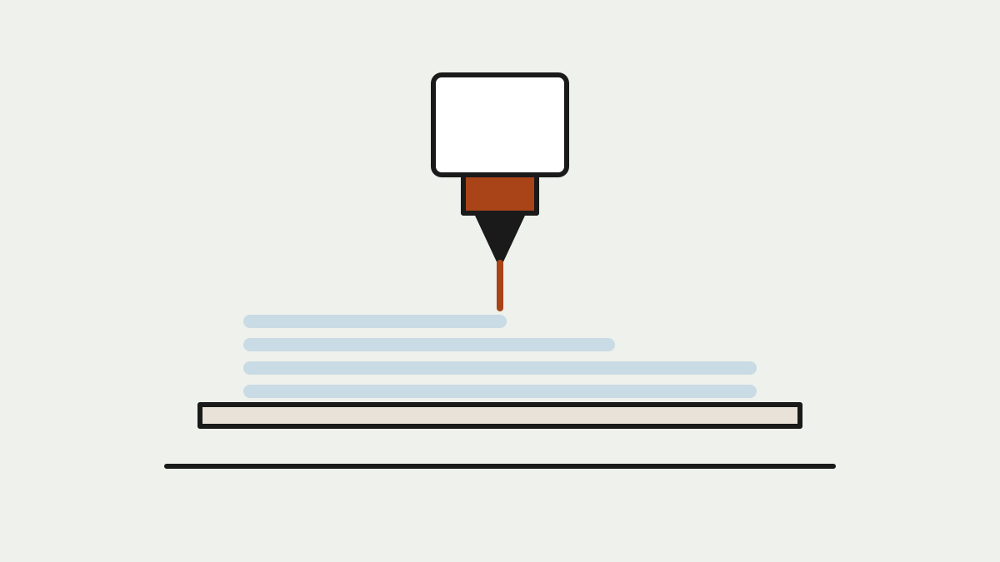
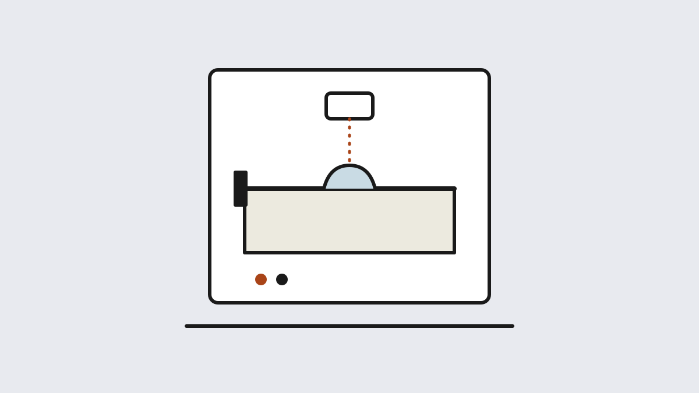

## What a 3D printer actually does {#what-is-3d-printing}

A 3D printer builds a physical object by adding material one thin layer at a
time — which is why engineers call the whole field **additive manufacturing**.
It's the opposite of how most things in your workshop get made. A lathe, a CNC
router or a milling machine is *subtractive*: it starts with a block of
material and cuts away everything that isn't the part. A printer starts with
nothing and deposits only the material the part needs, layer upon layer, each
one typically thinner than a sheet of paper.

That single idea has two consequences that explain why makers care:

- **Complexity is free.** An ornate lattice costs the printer no more effort
  than a solid cube. Shapes that are impossible to mold or machine — internal
  channels, captive hinges, organic curves — print without special tooling.
- **One-offs are cheap.** There is no mold to amortize and no setup cost. The
  first copy costs the same as the hundredth, which makes printers ideal for
  prototypes, repairs, and parts nobody sells — the discontinued dishwasher
  bracket, the adapter that joins two things that were never meant to meet.

The trade-off is time and material: printing is slow compared to molding, and
a printed part is usually weaker than an injection-molded or machined one.
That's why 3D printing dominates prototyping, customization and low-volume
production — not mass manufacturing.

## From file to object: how a print happens {#workflow}

Every technology in this chapter follows the same three-step pipeline:

1. **Model.** You need a 3D file, usually STL or 3MF. You can design one in
   CAD software (Tinkercad for beginners, Fusion 360 or FreeCAD for serious
   work) or download one — millions of free models live on libraries like
   Printables, MakerWorld and Thingiverse.
2. **Slice.** A free program called a *slicer* (PrusaSlicer, OrcaSlicer,
   Bambu Studio, Cura) cuts the model into hundreds of horizontal layers and
   writes the machine instructions: where to move, how fast, how hot, where to
   add temporary *support* structures under overhangs.
3. **Print and post-process.** The machine executes those layers over minutes
   or hours. Afterward you remove supports; resin parts additionally get
   washed and UV-cured, and powder parts get dug out and depowdered.

Understand that pipeline and the technologies below stop being mysterious —
they differ only in *how the layer gets formed*.

## FDM: the workhorse {#fdm}

<figure>
  
  <figcaption>FDM extrudes molten plastic filament, drawing each layer like a very precise hot-glue gun. Illustration: Makers Manual</figcaption>
</figure>

**Fused deposition modeling** (FDM, also called FFF) is what most people
picture: a spool of plastic **filament** feeds into a heated nozzle that draws
each layer onto a build plate. It is the cheapest technology to buy and to
run, the most forgiving to live with, and the only one that comfortably
prints big, tough, functional parts — brackets, enclosures, jigs, props,
replacement knobs.

Mechanically you'll meet two body plans: **bedslingers**, where the bed moves
back and forth (simpler, cheaper), and **CoreXY** machines, where the tool
head moves in a rigid frame (faster, increasingly the norm). Material choice
is FDM's superpower: cheap and easy **PLA** for most things, tougher **PETG**
for outdoor and mechanical parts, **ABS/ASA** for heat resistance (needs an
enclosure), flexible **TPU**, and glass- or carbon-fiber-filled nylons on
machines with hardened nozzles.

Its weakness is finish and fine detail: visible layer lines, and overhangs
that need support material.

**Who defines the category:** Bambu Lab's A1 (~$400) made fast,
self-calibrating printing the default expectation, with the X1-Carbon and
dual-nozzle H2D above it; Prusa's MK4S and CORE One (~$800–1,200) are the
open-ecosystem benchmark, endlessly repairable; Creality's Ender line
(~$200) still owns the budget floor; and the DIY Voron kits are the
enthusiast's speed project.

## Resin: the detail machine {#resin}

<figure>
  
  <figcaption>Resin printers cure liquid photopolymer against a light source — a whole layer flashes solid at once. Illustration: Makers Manual</figcaption>
</figure>

Resin printers — the family is called **vat photopolymerization**, sold as
**SLA**, **MSLA** or **DLP** — work upside down. The build plate dips into a
vat of liquid photopolymer, and UV light cures one entire layer at once:
consumer machines mask the light with an LCD screen (MSLA); professional SLA
machines trace it with a laser. The part rises out of the vat as it grows.

Because a "pixel" of cured resin is far smaller than any nozzle, resin prints
have detail and surface finish in a different league — layer lines
effectively vanish. This is the technology for tabletop miniatures, jewelry
casting masters, dental models and display-quality figures.

The costs are practical, not financial: liquid resin demands **gloves,
ventilation and a wash-and-cure routine** after every print; build volumes
are smaller; and standard resins are more brittle than FDM plastics (tough
and flexible engineering resins exist at a premium).

**Who defines the category:** Elegoo's Mars series (~$200–300) and Saturn
series (~$400–500) dominate the hobby, with Anycubic's Photon Mono line close
behind; Formlabs' Form 4 (~$3,500) is the professional desktop standard in
studios, dental labs and engineering shops.

## The industrial tier: SLS, metal and beyond {#industrial}

<figure>
  
  <figcaption>Powder-bed machines fuse each layer inside a bed of powder — which doubles as built-in support. Illustration: Makers Manual</figcaption>
</figure>

You probably won't put these on your bench, but you should know they exist —
partly to understand the industry, and partly because **online print
services will run them for you** at per-part prices.

- **SLS (selective laser sintering)** fuses nylon powder with a laser. The
  surrounding powder supports every layer, so complex geometry prints with
  *no support structures at all*, and parts are strong enough for end-use
  products. Benchtop machines like Formlabs' Fuse series and Sinterit's Lisa
  line start around $10,000–30,000.
- **MJF (Multi Jet Fusion)**, HP's powder process, is what many print
  services quote by default — similar strengths to SLS, tuned for batch
  production.
- **Metal printing (LPBF/DMLS/SLM)** does the same trick with titanium,
  steel or aluminum powder. Machines from EOS, Renishaw and SLM Solutions
  build aerospace brackets and medical implants, at six-to-seven-figure
  prices; bound-metal systems like Markforged's Metal X bring it closer to
  workshop scale.
- **The exotic edge:** PolyJet machines that jet full-color multi-material
  parts, pellet-fed printers the size of rooms, concrete printers extruding
  building walls, and bioprinting research depositing living cells.

The takeaway for a maker: if a part needs SLS nylon or metal, you don't buy
the machine — you upload the file to a print service and pay by the part.

## Which technology for which job {#choosing}

  <table class="compare">
    <thead>
      <tr>
        <th>Technology</th>
        <th>How a layer forms</th>
        <th>Best for</th>
        <th>Typical entry cost</th>
        <th>Defining machines</th>
      </tr>
    </thead>
    <tbody>
      <tr>
        <td><strong>FDM</strong></td>
        <td>Molten filament drawn by a nozzle</td>
        <td>Functional parts, big prints, everyday making</td>
        <td>$200–1,500</td>
        <td>Bambu Lab A1, Prusa MK4S, Creality Ender</td>
      </tr>
      <tr>
        <td><strong>Resin (MSLA/SLA)</strong></td>
        <td>UV light cures liquid photopolymer</td>
        <td>Miniatures, jewelry, dental, fine detail</td>
        <td>$200–4,000</td>
        <td>Elegoo Mars &amp; Saturn, Formlabs Form 4</td>
      </tr>
      <tr>
        <td><strong>SLS / MJF</strong></td>
        <td>Laser or agent fuses nylon powder</td>
        <td>Support-free complex parts, end-use nylon</td>
        <td>$10k+, or per-part via services</td>
        <td>Formlabs Fuse, Sinterit Lisa, HP Jet Fusion</td>
      </tr>
      <tr>
        <td><strong>Metal (LPBF)</strong></td>
        <td>Laser melts metal powder</td>
        <td>Aerospace, medical, tooling</td>
        <td>Six figures — service bureaus only</td>
        <td>EOS M-series, Renishaw, Markforged Metal X</td>
      </tr>
    </tbody>
  </table>

*Prices are approximate street prices at publication — treat them as
order-of-magnitude guides, not quotes.*

## The landscape right now {#landscape}

Three shifts define the current market, and they explain most of what you'll
read in any buying guide:

**The speed wars ended the patience era.** Input shaping (firmware that
cancels vibration) and CoreXY frames made 20-minute prints out of what took
two hours five years ago. Klipper firmware brought the same tricks to older
machines.

**Calibration became the machine's job.** Auto bed leveling, filament
sensors and flow calibration turned setup from the hobby's biggest
frustration into a non-event. Any printer that still needs manual leveling is
obsolete.

**Ecosystems split open vs. closed.** Bambu Lab's app-store-like polish —
cloud slicing, the AMS multi-color unit, a curated model library — brought
appliance convenience and appliance lock-in. Prusa, Voron and the open-source
community push the opposite direction: repairable machines, open firmware,
open model libraries. Which side you pick is now as important as which specs
you buy — a theme the next chapter returns to.

## Terms you'll hear {#glossary}

- **Build volume** — the largest object a printer can make, quoted as X × Y × Z mm.
- **Layer height** — thickness of each slice; smaller = finer finish, longer print.
- **Slicer** — the software that converts a 3D model into machine instructions (G-code).
- **Supports** — temporary printed scaffolding under overhangs; snapped off afterward.
- **Infill** — the internal lattice inside a "solid" part; 15% infill is typical.
- **Bed adhesion** — keeping the first layer stuck; failures here cause most ruined prints.
- **Direct drive vs. Bowden** — whether the filament motor rides on the nozzle (better for flexibles) or pushes through a tube (lighter head).
- **AMS / MMU** — multi-spool units that enable multi-color or multi-material FDM prints.
- **Wash & cure** — the two-step post-processing every resin print needs.
- **Benchy** — the little tugboat model the whole hobby uses as a calibration benchmark.

---

**Ready to choose a machine?** The next chapter, [The Best 3D Printers for
Makers](3d-printers.html), applies this map to the current market — our
tested picks for most people, tight budgets and fine-detail work.

## References {#references}

1. Wikipedia, [3D printing](https://en.wikipedia.org/wiki/3D_printing) — broad overview of additive manufacturing and its history.
2. Wikipedia, [Fused filament fabrication](https://en.wikipedia.org/wiki/Fused_filament_fabrication) — the FDM/FFF process in technical depth.
3. Wikipedia, [Stereolithography](https://en.wikipedia.org/wiki/Stereolithography) and [Selective laser sintering](https://en.wikipedia.org/wiki/Selective_laser_sintering) — the resin and powder-bed processes.
4. All3DP, [The Main Types of 3D Printing Technology](https://all3dp.com/1/types-of-3d-printers-3d-printing-technology/) — a regularly updated survey of every process on the market.
5. Formlabs, [Guide to Stereolithography (SLA) 3D Printing](https://formlabs.com/blog/ultimate-guide-to-stereolithography-sla-3d-printing/) and [What Is Selective Laser Sintering?](https://formlabs.com/blog/what-is-selective-laser-sintering/) — vendor guides, but among the clearest process explainers published.
6. Manufacturer pages for the machines named in this chapter: [Bambu Lab](https://bambulab.com), [Prusa Research](https://www.prusa3d.com), [Creality](https://www.creality.com), [Voron Design](https://vorondesign.com), [Elegoo](https://www.elegoo.com), [Anycubic](https://www.anycubic.com), [Formlabs](https://formlabs.com), [Sinterit](https://sinterit.com), [Markforged](https://markforged.com), [EOS](https://www.eos.info), [HP Jet Fusion](https://www.hp.com/us-en/printers/3d-printers.html).
7. Model libraries: [Printables](https://www.printables.com), [MakerWorld](https://makerworld.com), [Thingiverse](https://www.thingiverse.com).
8. Slicers and firmware: [PrusaSlicer](https://github.com/prusa3d/PrusaSlicer), [OrcaSlicer](https://github.com/SoftFever/OrcaSlicer), [Bambu Studio](https://github.com/bambulab/BambuStudio), [UltiMaker Cura](https://ultimaker.com/software/ultimaker-cura/), [Klipper](https://www.klipper3d.org).
{: .references}

*Links accessed July 2026. Specifications and prices cited in this chapter
should be verified against the manufacturer pages above.*
